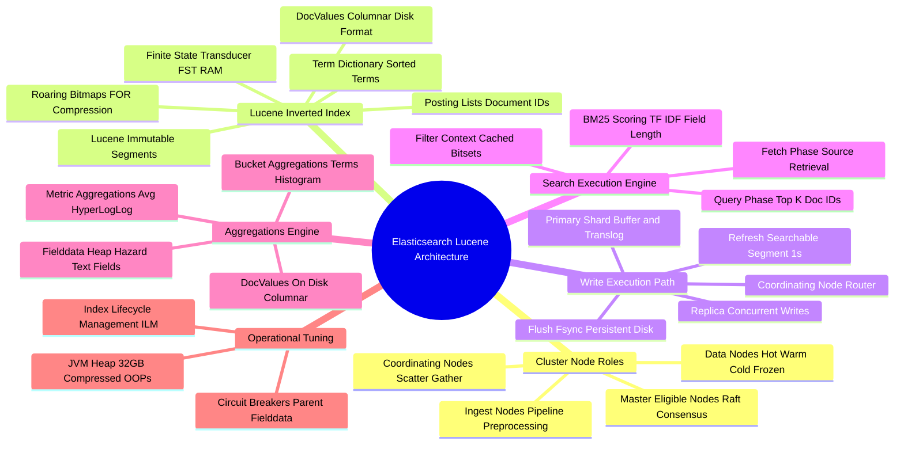

# Elasticsearch & Apache Lucene Technical Study Guide

Welcome to the **Elasticsearch & Apache Lucene Technical Study Guide**. This repository contains deep-dive chapters covering distributed cluster node roles, Lucene inverted index architecture (Term Dictionary, Posting Lists, FST, DocValues), document indexing write execution paths (Translog, Refresh, Flush), 2-phase scatter-gather search execution (Query vs Filter context, BM25 scoring), aggregations engine, text analysis pipelines (Tokenizers, Stemmers), JVM compressed OOPs heap tuning, circuit breakers, and Index Lifecycle Management (ILM).

---

## 1. Executive Summary & Core Mechanics

Elasticsearch is a distributed, JSON-native search and analytics engine built on top of the **Apache Lucene** search library. It provides real-time full-text search, complex structured filtering, and near-instant analytical aggregations across massive datasets.

Key Architectural Highlights:
* **Cluster Node Roles:** Dedicated Master nodes (Raft consensus), Data nodes (Hot/Warm/Cold/Frozen), Ingest nodes, Machine Learning nodes, and Coordinating nodes.
* **Apache Lucene Inverted Index:** Maps terms to document IDs using Finite State Transducers (FST), Frame of Reference (FOR) posting list compression, and Roaring Bitmaps.
* **Document Write Path:** Writes append to an in-memory Index Buffer and a disk **Translog**. Periodically **Refreshed** to searchable Lucene segments in OS page cache (default 1s) and **Flushed** (`fsync`) to persistent storage.
* **Two-Phase Search Execution:** Search executes via a 2-phase **Scatter-Gather** pattern: Query Phase (fetches top $K$ doc IDs + BM25 relevance scores from all shards) followed by Fetch Phase (fetches full `_source` documents).
* **Columnar Storage (DocValues):** Disk-based columnar data structure enabling high-speed aggregations and sorting without consuming JVM heap memory.

---

## 2. Interactive Architecture Mind Map

---

## 3. Study Guide Chapter Index

| Chapter | Title | Focus Areas |
| :--- | :--- | :--- |
| **[00: Recommended Resources](00_Recommended_Books_and_Resources.md)** | Reading List & Reference Material | Books (*Elasticsearch: The Definitive Guide*, *Relevant Search*), Lucene codebase |
| **[00: Architecture Mind Map](00_Elasticsearch_MindMap.md)** | Interactive Taxonomy | Full visual breakdown of Lucene inverted index, write/search paths, and ILM lifecycle |
| **[Chapter 1](ch01_architecture_cluster_shards.md)** | Cluster Node Roles & Shard Architecture | Master/Data/Ingest/Coordinating roles, primary vs replica shard routing, Raft cluster state |
| **[Chapter 2](ch02_lucene_inverted_index_fst.md)** | Lucene Inverted Index & Internal Storage | Term Dictionary, Posting Lists (FOR/Roaring), FST in-memory structure, DocValues vs `_source` |
| **[Chapter 3](ch03_document_indexing_write_path.md)** | Write Execution Path & Translog | In-memory Index Buffer, Translog WAL, Refresh (page cache) vs Flush (`fsync`), segment merging |
| **[Chapter 4](ch04_search_execution_query_vs_filter.md)** | Search Execution Path, Query vs Filter | Scatter-Gather 2-phase search, BM25 scoring algorithm, Filter bitset caching |
| **[Chapter 5](ch05_aggregations_doc_values_fielddata.md)** | Aggregations Engine & Columnar Storage | Bucket & Metric aggs, DocValues disk format, Fielddata JVM heap exhaustion hazard |
| **[Chapter 6](ch06_mapping_text_analysis_tokenizers.md)** | Mapping, Text Analysis & Tokenizers | Character Filters, Tokenizers, Token Filters, `text` vs `keyword`, Dynamic mapping limits |
| **[Chapter 7](ch07_performance_tuning_heap_circuit_breakers.md)** | Performance Tuning & Heap Management | 32GB Compressed OOPs limit, Circuit Breakers, `_cat` diagnostic APIs, ILM index lifecycle |

---

## 4. Quick Links & Navigation

* Return to [Master Tech-Stack Directory](../README.md)
* Next Chapter: **[Chapter 1: Cluster Architecture & Shard Routing](ch01_architecture_cluster_shards.md)**
