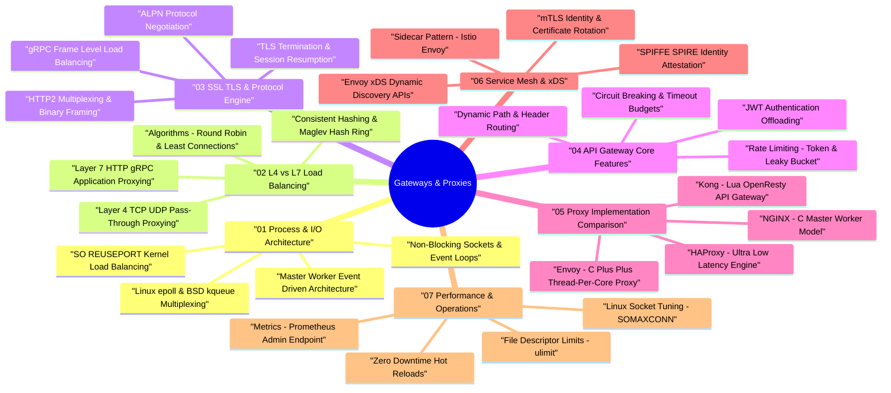

# API Gateways, Reverse Proxies & Load Balancers Architecture Taxonomy & Interactive Mind Map

API Gateways, Reverse Proxies, and Load Balancers form the traffic management backbone of modern distributed systems, handling incoming client traffic, protocol translation, load distribution, security enforcement, and service discovery.

---

## 🧠 Interactive Gateway & Proxy Architecture Mind Map

---

## 📊 Core Component Matrix

| Proxy Technology | Architectural Model | Primary Use Case | Key Strength |
| :--- | :--- | :--- | :--- |
| **NGINX** | C Master/Worker Event-Loop Process Model | Web Server, Reverse Proxy, Static File Serving | Proven stability, low RAM footprint, vast community |
| **HAProxy** | C Single-Process Event-Driven Engine | High-Throughput Layer 4 / Layer 7 Load Balancer | Sub-millisecond latency, extreme L4 TCP throughput |
| **Envoy Proxy** | C++ Thread-per-Core Asynchronous Engine | Service Mesh Sidecar, Modern API Gateway | Native gRPC/HTTP2, dynamic xDS API control plane |
| **Kong Gateway** | Lua / OpenResty wrapper over NGINX | Modular Enterprise API Gateway | Rich plugin ecosystem, RESTful admin configuration API |
| **Traefik** | Go Event-Driven Microservice Proxy | Cloud-Native Kubernetes Ingress Controller | Automatic dynamic service discovery (K8s, Docker) |
