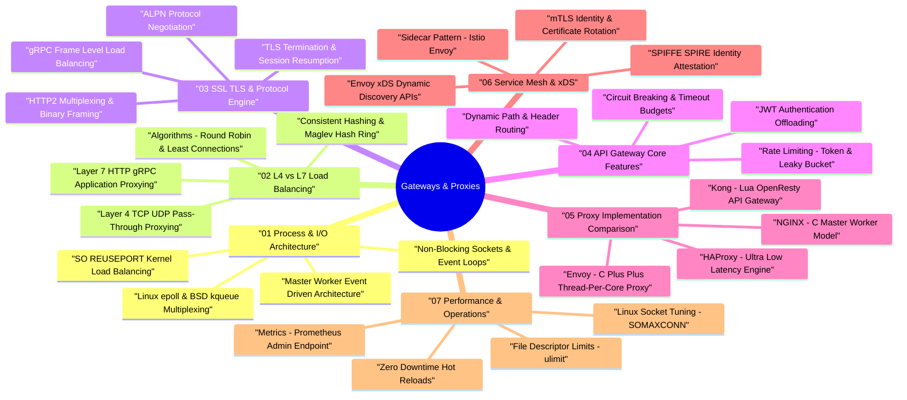

# API Gateways, Reverse Proxies & Load Balancers Architecture — Deep Dive Study Guide

> **Goal:** Master non-blocking event-driven process architectures (`epoll`/`kqueue`), Layer 4 vs Layer 7 load balancing algorithms, SSL/TLS termination & HTTP/2/gRPC multiplexing, API Gateway dynamic routing & rate limiting, NGINX vs HAProxy vs Envoy vs Kong implementation trade-offs, Service Mesh xDS dynamic control planes, and production performance tuning for Staff Software Engineering.

---

## 🧠 Interactive Gateway & Proxy Architecture Mind Map

👉 **Full Mind Map & Taxonomy:** [`00_GatewayProxy_MindMap.md`](00_GatewayProxy_MindMap.md)  
📚 **Recommended Books & References:** [`00_Recommended_Books_and_Resources.md`](00_Recommended_Books_and_Resources.md)

---

## 📖 Chapter Index

1. **[Ch 1: Process Architecture & Event-Driven Non-Blocking I/O](ch01_architecture_event_driven_process_models.md)** — Thread-per-connection vs Master-Worker event-loop models, `epoll`/`kqueue`/`io_uring` kernel multiplexing, non-blocking sockets, `SO_REUSEPORT` load distribution.
2. **[Ch 2: Layer 4 vs Layer 7 Load Balancing & Algorithms](ch02_l4_vs_l7_load_balancing_algorithms.md)** — L4 TCP/UDP pass-through vs L7 HTTP/gRPC inspection, load balancing algorithms (Round Robin, Weighted, Least Connections, Consistent Hashing, Maglev Hashing), active vs passive health probes.
3. **[Ch 3: SSL/TLS Termination, Keep-Alive & Protocol Multiplexing](ch03_ssl_tls_termination_http2_grpc.md)** — SSL/TLS termination, Session Resumption, OCSP Stapling, HTTP/1.1 Pipelining vs HTTP/2 Binary Framing & Multiplexing vs HTTP/3 QUIC, resolving gRPC long-lived TCP load balancing problems via L7 Envoy proxies.
4. **[Ch 4: API Gateway Core Features & Routing Engines](ch04_api_gateway_features_routing.md)** — API Gateway vs Reverse Proxy vs Load Balancer distinctions, dynamic path/header routing, Rate Limiting (Token Bucket / Leaky Bucket), Circuit Breaking (State Machine), JWT/OAuth2 offloading.
5. **[Ch 5: NGINX vs HAProxy vs Envoy vs Kong Deep-Dive Comparison](ch05_nginx_haproxy_envoy_comparison.md)** — Architectural trade-offs across NGINX (C master/worker), HAProxy (C single-process low-latency L4/L7), Envoy (C++ thread-per-core xDS dynamic proxy), and Kong (Lua/OpenResty).
6. **[Ch 6: Service Mesh Architecture & Dynamic Control Plane (xDS)](ch06_service_mesh_sidecar_xds.md)** — Sidecar proxy pattern (Istio/Envoy), Envoy xDS APIs (LDS, RDS, CDS, EDS), mTLS identity attestation (SPIFFE/SPIRE) & certificate rotation.
7. **[Ch 7: Operational Performance Tuning & Diagnostics](ch07_performance_tuning_troubleshooting.md)** — Linux kernel TCP socket tuning (`SOMAXCONN`, `tcp_max_syn_backlog`), open file descriptors (`ulimit -n`), metric monitoring endpoints, zero-downtime hot reloads (`SIGUSR2` / `SIGHUP`).
