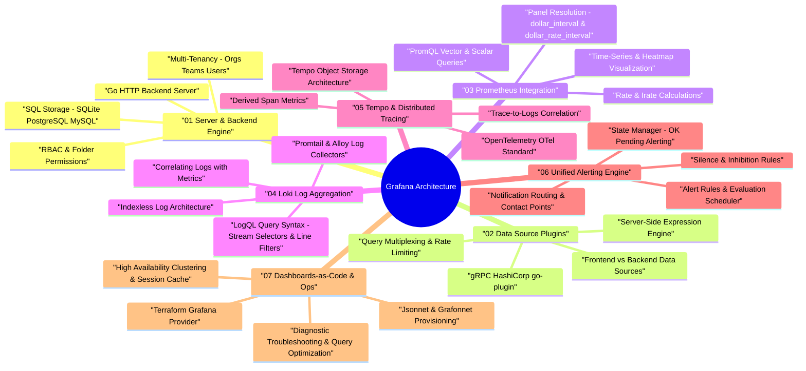

# Grafana Architecture Taxonomy & Interactive Mind Map

Grafana is an open-source, multi-platform operational observability and data visualization platform. It connects to disparate data sources (Prometheus, Loki, Tempo, PostgreSQL, Elasticsearch) to render real-time dashboards, unified alerting, and correlated telemetry across metrics, logs, and distributed traces (the **LGTM** stack).

---

## 🧠 Interactive Grafana Architecture Mind Map

---

## 📊 Core Component Matrix

| Subsystem | Core Component / Tech | Primary Responsibility | Key Mechanism |
| :--- | :--- | :--- | :--- |
| **Backend Server** | Go HTTP Server, SQL Database | Manages web API, authentication, dashboard state, organizations, and permissions | SQLite / Postgres database schema, `chi` HTTP router |
| **Plugin Engine** | gRPC, `go-plugin` | Connects Grafana to third-party metric, log, trace, and relational databases | IPC via Unix sockets / TCP gRPC buffers |
| **Query Engine** | Server-Side Expressions (SSE) | Evaluates math, resample, reduce, and threshold operations on query streams | Go pipeline execution before client rendering |
| **Metrics Plugin** | Prometheus / PromQL | Queries time-series metrics data from Prometheus, Mimir, or Thanos | HTTP REST API `/api/v1/query_range` |
| **Log Engine** | Loki / LogQL | Queries log streams using label-based indexing without full-text indexing overhead | Chunk storage retrieval + LogQL stream evaluation |
| **Tracing Engine** | Tempo / OpenTelemetry | Fetches distributed trace trees matching TraceIDs or search filters | Object storage scan (S3/GCS) + Parquet indexing |
| **Alert Engine** | Unified Alerting | Schedules alert rule evaluations, tracks state changes, routes notifications | Alertmanager routing tree, PagerDuty/Slack webhooks |
