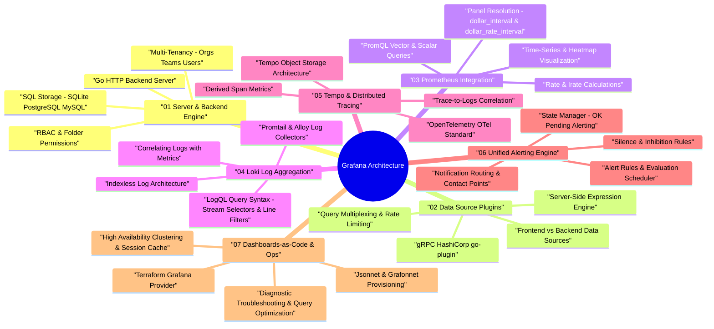

# Grafana Architecture & Observability Engine — Deep Dive Study Guide

> **Goal:** Master Grafana server backend architecture, data source plugin models (gRPC), PromQL metric panel optimizations, Loki log aggregation (LogQL), Tempo distributed tracing, Unified Alerting Engine, GitOps Dashboards-as-Code (Jsonnet / Terraform), and high-availability operational diagnostics for Staff Software Engineering.

---

## 🧠 Interactive Grafana Architecture Mind Map

👉 **Full Mind Map & Taxonomy:** [`00_Grafana_MindMap.md`](00_Grafana_MindMap.md)  
📚 **Recommended Books & References:** [`00_Recommended_Books_and_Resources.md`](00_Recommended_Books_and_Resources.md)

---

## 📖 Chapter Index

1. **[Ch 1: Grafana Server Architecture & Backend Engine](ch01_architecture_backend_engine.md)** — Go HTTP backend server, SQL metadata storage (SQLite/Postgres/MySQL), multi-tenancy (Orgs, Teams, Users), RBAC permission tree, frontend React/uPlot rendering.
2. **[Ch 2: Data Source Plugins & Query Execution Pipeline](ch02_datasource_plugins_query_pipeline.md)** — Frontend vs Backend Data Source plugins, gRPC via HashiCorp `go-plugin`, Server-Side Expression (SSE) engine (Math, Reduce, Resample), query connection pooling & rate limiting.
3. **[Ch 3: Prometheus & PromQL Query Visualization](ch03_prometheus_promql_integration.md)** — PromQL query syntax, Instant vs Range vectors, `rate()` vs `irate()`, panel resolution variables (`$__interval`, `$__rate_interval`), rendering optimizations.
4. **[Ch 4: Grafana Loki & Log Aggregation (LogQL)](ch04_loki_log_aggregation.md)** — Indexless log architecture, LogQL query streams & line filters, Promtail / Grafana Alloy, chunk storage (S3/GCS), correlating logs with time-series metrics.
5. **[Ch 5: Grafana Tempo, Jaeger & Distributed Tracing](ch05_tempo_tracing_opentelemetry.md)** — Distributed tracing fundamentals, OpenTelemetry (OTel) Collector standard, Tempo object storage, Trace-to-Logs & Trace-to-Metrics correlated observability.
6. **[Ch 6: Unified Alerting Engine](ch06_alerting_unified_engine.md)** — Alert Rules, Evaluation Scheduler, State Manager (`OK`, `Pending`, `Alerting`), Contact Points (PagerDuty, Slack), notification routing trees, silence & inhibition rules.
7. **[Ch 7: Dashboards-as-Code, Security & Production Diagnostics](ch07_dashboards_as_code_troubleshooting.md)** — GitOps provisioning (Jsonnet / Grafonnet), Terraform Grafana Provider, HA clustering & Redis session cache, query performance tuning, and panel rendering freezes.
