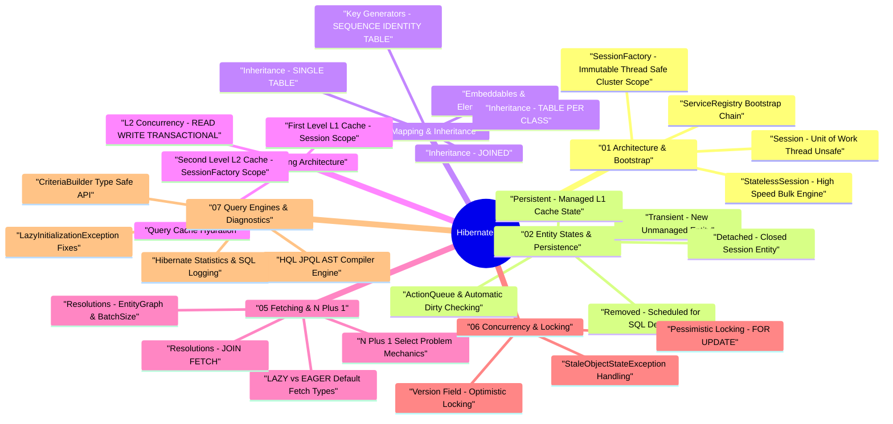

# Hibernate ORM Architecture Taxonomy & Interactive Mind Map

Hibernate ORM is an enterprise object-relational mapping framework for Java. It maps idiomatic domain model object graphs to relational database tables, managing SQL generation, state persistence, caching, and transaction boundaries.

---

## 🧠 Interactive Hibernate Architecture Mind Map

---

## 📊 Core Component Matrix

| Subsystem | Core Interface / Class | Primary Responsibility | Key Mechanism |
| :--- | :--- | :--- | :--- |
| **Bootstrap Engine** | `StandardServiceRegistryBuilder`, `MetadataSources` | Builds service registry, parses mappings, produces `SessionFactory` | XML / Annotation parsing, Dialect resolution |
| **Session Manager** | `SessionFactory`, `Session` | Manages database connections, entity lifecycle, and unit of work | JDBC Connection Pool wrapper, L1 Cache |
| **Persistence Context** | `StatefulPersistenceContext` | Enforces entity identity (`a == b`), dirty checking, ActionQueue ordering | Identity Map, Snapshot array comparisons |
| **Action Queue** | `ActionQueue` | Queues and orders SQL DML operations prior to transaction commit | Inserts $\to$ Updates $\to$ Collection Deletes $\to$ Deletes |
| **L2 Cache Engine** | `RegionFactory`, `DomainDataRegion` | Shared cross-session caching for entity state and collection data | Ehcache / Infinispan / Hazelcast integration |
| **Query Engine** | `HqlParser`, `CriteriaBuilderImpl` | Translates HQL, JPQL, or Criteria queries into native SQL dialects | ANTLR AST parser, Dialect SQL translator |
