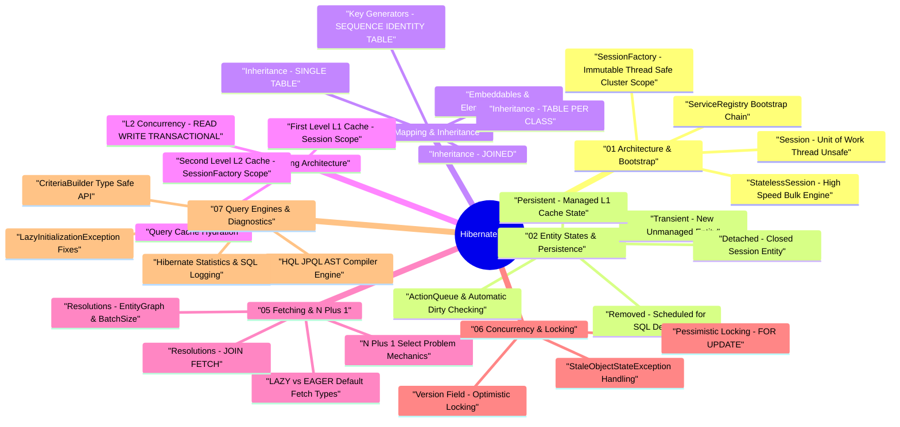

# Hibernate ORM Architecture & Performance — Deep Dive Study Guide

> **Goal:** Master Hibernate ORM bootstrap engine, `SessionFactory`/`Session` unit of work, Entity Lifecycle state transitions, Persistence Context (L1 Cache & Automatic Dirty Checking), Inheritance mapping strategies, Multi-Level Caching (L2 & Query Cache), Fetching Strategies (resolving N+1 queries), Optimistic/Pessimistic Locking, and HQL/Criteria performance diagnostics for Staff Software Engineering.

---

## 🧠 Interactive Hibernate Architecture Mind Map

👉 **Full Mind Map & Taxonomy:** [`00_Hibernate_MindMap.md`](00_Hibernate_MindMap.md)  
📚 **Recommended Books & References:** [`00_Recommended_Books_and_Resources.md`](00_Recommended_Books_and_Resources.md)

---

## 📖 Chapter Index

1. **[Ch 1: Hibernate Architecture & Bootstrap Engine](ch01_architecture_session_factory.md)** — Bootstrap sequence, `ServiceRegistry`, `SessionFactory` vs `Session` vs `StatelessSession`, Dialect engine, HikariCP integration.
2. **[Ch 2: Entity Lifecycle & Persistence Context](ch02_entity_states_persistence_context.md)** — Entity states (`Transient`, `Persistent`, `Detached`, `Removed`), state transitions, Persistence Context (L1 Cache), ActionQueue execution ordering, Automatic Dirty Checking.
3. **[Ch 3: Mapping Strategies & Inheritance Models](ch03_mapping_strategies_inheritance.md)** — Primary key generation strategies (`SEQUENCE`, `IDENTITY`, `TABLE`), `@Embeddable` components, Inheritance mappings (`SINGLE_TABLE`, `JOINED`, `TABLE_PER_CLASS`).
4. **[Ch 4: Multi-Level Caching Architecture (L1, L2 & Query Cache)](ch04_caching_l1_l2_query_cache.md)** — First-Level (L1) vs Second-Level (L2) Cache (Ehcache/Infinispan), L2 concurrency strategies (`READ_WRITE`, `TRANSACTIONAL`), Query Cache hydration.
5. **[Ch 5: Fetching Strategies & Performance Optimization](ch05_fetching_strategies_n_plus_1.md)** — `LAZY` vs `EAGER` defaults, N+1 Select problem, resolutions via `JOIN FETCH`, `@EntityGraph`, `@BatchSize`, and `@Fetch(FetchMode.SUBSELECT)`.
6. **[Ch 6: Concurrency Control & Locking Mechanisms](ch06_concurrency_locking_versioning.md)** — `@Version` Optimistic locking (`StaleObjectStateException`), Pessimistic locking (`PESSIMISTIC_WRITE` / `FOR UPDATE`), deadlock prevention.
7. **[Ch 7: HQL / JPQL, Criteria API & Performance Diagnostics](ch07_hql_jpql_criteria_troubleshooting.md)** — HQL / JPQL AST engine, CriteriaBuilder type-safe queries, `hibernate.generate_statistics`, fixing `LazyInitializationException` and session leaks.
