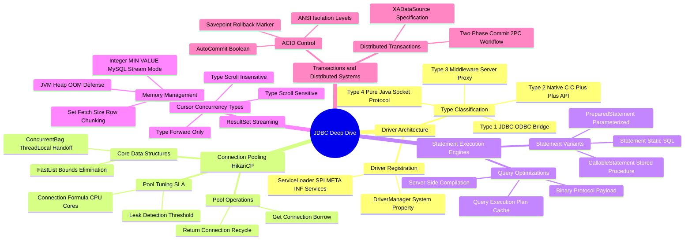

# JDBC Architecture Mind Map

This document presents a structured visual breakdown of low-level JDBC internals.

---

## 1. Visual Taxonomy

---

## 2. Component Reference Table

| Component | Responsibility | Performance Bottlenecks & Hazards |
| :--- | :--- | :--- |
| **`DriverManager`** | Manages loaded database driver instances | Synchronized methods causing thread contention in legacy apps |
| **`HikariCP ConcurrentBag`** | Lock-free thread-local connection allocation pool | Pool exhaustion (`SQLTransientConnectionException`) under high load |
| **`PreparedStatement`** | Parameterized SQL query compilation and execution | Driver memory leak if statements are created in loops without `.close()` |
| **`ResultSet`** | Streams database query result rows to JVM memory | Memory OOM crash when executing large queries without `setFetchSize()` |
| **`Savepoint`** | Marks transactional undo checkpoints | High database lock retention when savepoints remain open across long transactions |
| **`XAConnection`** | Manages distributed 2PC transactions | In-doubt XA transactions holding row locks on database crash |
