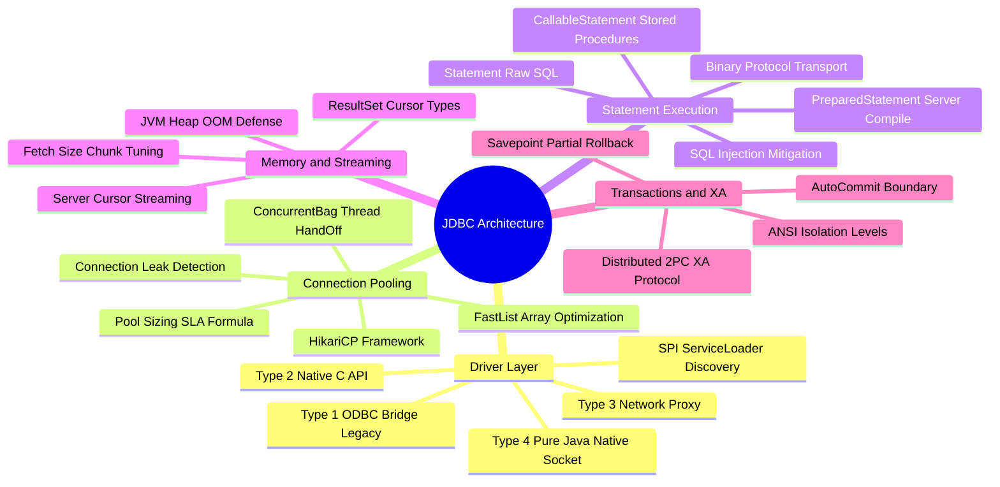

# JDBC (Java Database Connectivity) Technical Study Guide

Welcome to the **JDBC Technical Study Guide**. This repository contains deep-dive chapters covering low-level JDBC driver architecture (Types 1–4), high-performance connection pooling (HikariCP internals, `ConcurrentBag`, `FastList`), `PreparedStatement` server-side query compilation & binary protocol transport, `ResultSet` fetch size streaming & JVM memory management, transaction isolation levels & Savepoints, high-throughput batching, distributed 2PC XA transactions, and operational connection leak diagnostics.

---

## 1. Executive Summary & Core Mechanics

**JDBC (Java Database Connectivity)** is the standard Java API (`java.sql` and `javax.sql`) defining vendor-neutral database interactions between Java applications and relational database engines.

Key Architectural Highlights:
* **Driver Architecture (Types 1–4):** Evolved from native C/ODBC bridges to pure-Java Type 4 drivers that communicate directly with database servers over raw socket binary protocols.
* **HikariCP Connection Pool:** A zero-overhead production connection pool leveraging lock-free thread-local handoffs (`ConcurrentBag`), custom array structures (`FastList`), and bytecode-generated statement proxies.
* **PreparedStatement Compilation:** Mitigates SQL Injection risks while enabling server-side compilation, execution plan caching, and binary protocol payload transport.
* **ResultSet Streaming:** Controls memory consumption during massive queries using `setFetchSize(int rows)` to prevent JVM OutOfMemory (OOM) heap exhaustion.
* **Transaction Control & Savepoints:** Manages ACID transaction boundaries, ANSI isolation levels (`READ_COMMITTED`, `REPEATABLE_READ`, `SERIALIZABLE`), and partial rollbacks via `Savepoint`.

---

## 2. Interactive Architecture Mind Map

---

## 3. Study Guide Chapter Index

| Chapter | Title | Focus Areas |
| :--- | :--- | :--- |
| **[00: Recommended Resources](00_Recommended_Books_and_Resources.md)** | Reading List & Reference Material | JDBC Specs, HikariCP wiki, PostgreSQL `pgjdbc` & MySQL `connector-j` GitHub repos |
| **[00: Architecture Mind Map](00_JDBC_MindMap.md)** | Interactive Taxonomy | Full visual breakdown of Driver types, HikariCP, Statements, and XA transactions |
| **[Chapter 1](ch01_jdbc_architecture_driver_types.md)** | Architecture & Driver Types 1–4 | Driver Types 1–4, `DriverManager` vs `DataSource`, `ServiceLoader` SPI auto-registration |
| **[Chapter 2](ch02_connection_management_hikaricp.md)** | Connection Management & HikariCP | TCP connection overhead, HikariCP `ConcurrentBag`, `FastList`, pool sizing SLA formula |
| **[Chapter 3](ch03_statements_preparedstatement_callable.md)** | Statements & PreparedStatement Internals | `Statement` vs `PreparedStatement` vs `CallableStatement`, SQL injection defense, server-side statement caching |
| **[Chapter 4](ch04_resultset_streaming_fetchsize.md)** | ResultSet Streaming & Fetch Size | ResultSet cursor types, `setFetchSize()` chunking, JVM OOM prevention, MySQL streaming mode |
| **[Chapter 5](ch05_transactions_isolation_savepoints.md)** | Transactions, Isolation & Savepoints | Auto-commit mode, ANSI SQL isolation levels, `Savepoint` partial rollbacks |
| **[Chapter 6](ch06_batch_processing_xa_transactions.md)** | Batch Processing & XA 2PC | JDBC `executeBatch()`, `rewriteBatchedStatements`, `XADataSource`, 2-Phase Commit distributed transactions |
| **[Chapter 7](ch07_performance_tuning_leak_detection.md)** | Diagnostics, Leak Detection & Tuning | HikariCP `leakDetectionThreshold`, query/socket timeouts, JDBC proxy logging (`p6spy`, `log4jdbc`) |

---

## 4. Quick Links & Navigation

* Return to [Master Tech-Stack Directory](../README.md)
* Next Chapter: **[Chapter 1: JDBC Architecture & Type 1–4 Driver Models](ch01_jdbc_architecture_driver_types.md)**
