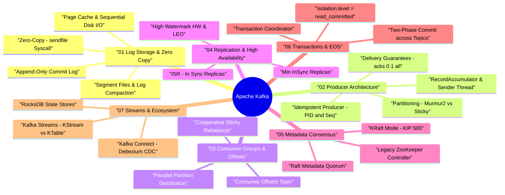

# Apache Kafka Architecture & Internals — Deep Dive Study Guide

> **Goal:** Master Apache Kafka internal architecture, Zero-Copy OS page caching, log storage primitives, Producer batching & idempotency, Consumer Group cooperative rebalancing, ISR replication math, KRaft Raft consensus controller, Exactly-Once Semantics (EOS), and Kafka Streams for Staff Software Engineering system design.

---

## 🧠 Interactive Kafka Architecture Mind Map

👉 **Full Mind Map & Taxonomy:** [`00_Kafka_MindMap.md`](00_Kafka_MindMap.md)

---

## 📖 Chapter Index

1. **[Ch 1: Core Architecture & Log Storage Internals](ch01_log_storage_and_zero_copy.md)** — Append-Only Commit Log, Zero-Copy `sendfile`, Page Cache, Segments & Log Compaction.
2. **[Ch 2: Producer Internals & Message Delivery](ch02_producer_internals_and_delivery.md)** — RecordAccumulator, Sender thread, `acks=all`, Idempotent Producer.
3. **[Ch 3: Consumer Groups, Rebalancing & Offsets](ch03_consumer_groups_and_rebalancing.md)** — Parallel partition consumption, Cooperative Sticky Rebalancing, `__consumer_offsets`.
4. **[Ch 4: Replication, High Availability & ISR Mechanics](ch04_replication_isr_high_watermark.md)** — In-Sync Replicas (ISR), High Watermark (HW), Log End Offset (LEO), `min.insync.replicas`.
5. **[Ch 5: Consensus & Metadata (ZooKeeper vs. KRaft)](ch05_consensus_zookeeper_vs_kraft.md)** — Legacy ZooKeeper vs. KRaft Raft Quorum Controller (KIP-500).
6. **[Ch 6: Transactions & Exactly-Once Semantics (EOS)](ch06_transactions_and_exactly_once.md)** — Transaction Coordinator, 2PC across topics, `read_committed`.
7. **[Ch 7: Kafka Ecosystem: Connect, Streams & Tuning](ch07_connect_streams_performance_tuning.md)** — Kafka Connect, CDC (Debezium), Kafka Streams (KStream/KTable), JMX Tuning.
