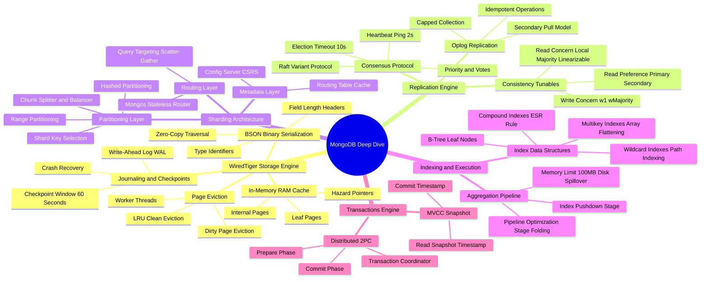

# MongoDB Architecture Mind Map

This document presents a structured visual and conceptual breakdown of MongoDB's distributed document database internals.

---

## 1. Visual Taxonomy

---

## 2. Component Reference Table

| Component | Responsibility | Performance Bottlenecks |
| :--- | :--- | :--- |
| **WiredTiger Cache** | Caches uncompressed raw data pages in RAM | High dirty-page ratio blocking client threads |
| **Journal (WAL)** | Disk persistence log flushed every 50ms | Disk I/O ops limits (IOPS) causing write stalls |
| **Oplog (`local.oplog.rs`)** | Capped collection recording all database mutations | Small oplog window leading to `Stale` secondaries |
| **`mongos` Router** | Routes queries to shards using Config metadata | Memory overhead when caching high chunk count metadata |
| **Config Server CSRS** | Stores cluster routing rules and chunk mappings | Master failure blocking chunk splits/migrations |
| **Balancer** | Migrates chunks between shards for even load | High network saturation during active chunk migrations |
