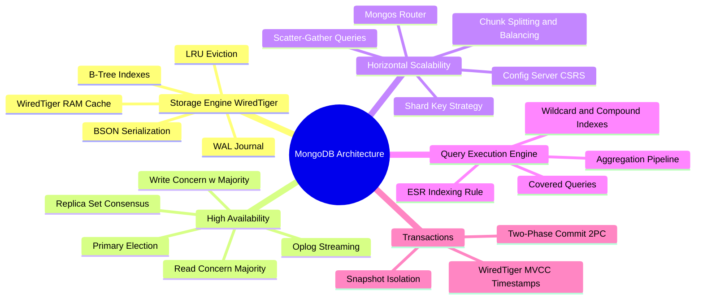

# MongoDB / Document Databases Technical Study Guide

Welcome to the **MongoDB & Document Databases Technical Study Guide**. This repository contains deep-dive chapters covering MongoDB internal architecture, the WiredTiger storage engine, Replica Set Raft-like consensus & Oplog replication, horizontal sharding & chunk balancing, query indexing & aggregation mechanics, multi-document ACID transactions, and production performance diagnostics.

---

## 1. Executive Summary & Core Mechanics

MongoDB is a distributed, document-oriented NoSQL database designed for high availability, horizontal scalability, and flexible document schema. At its core, MongoDB stores data as **BSON** (Binary JSON) documents backed by the **WiredTiger** storage engine. 

Key Architectural Highlights:
* **WiredTiger Storage Engine:** Uses lock-free CPU operations, hazard pointers, multi-version concurrency control (MVCC), in-memory page eviction algorithms, and Write-Ahead Logging (WAL / Journaling).
* **Replica Set Consensus:** Uses a Raft-variant protocol for election of a single Primary node, combined with asynchronous or synchronous Oplog replication to Secondaries with customizable Read/Write Concerns.
* **Horizontal Sharding:** Distributes collections across shards using range-based or hash-based partition keys managed via `mongos` routing routers and a Config Server Replica Set (CSRS).
* **Multi-Document ACID Transactions:** Enables distributed 2-Phase Commit (2PC) transactions across shards using global snapshot timestamps and WiredTiger MVCC.

---

## 2. Interactive Architecture Mind Map

---

## 3. Study Guide Chapter Index

| Chapter | Title | Focus Areas |
| :--- | :--- | :--- |
| **[00: Recommended Resources](00_Recommended_Books_and_Resources.md)** | Reading List & Reference Material | Official Docs, Books (*MongoDB in Action*, *Designing Data-Intensive Applications*), Code Repositories |
| **[00: Architecture Mind Map](00_MongoDB_MindMap.md)** | Interactive Taxonomy | Full visual breakdown of WiredTiger, Replica Sets, Sharding, and Indexing |
| **[Chapter 1](ch01_bson_wiredtiger_storage_engine.md)** | BSON & WiredTiger Storage Engine | BSON binary encoding, WiredTiger RAM cache, hazard pointers, page eviction, checkpoints, WAL journal |
| **[Chapter 2](ch02_replica_sets_oplog_consensus.md)** | Replica Sets, Oplog & Consensus | Primary-Secondary Raft election, Oplog capped collection, Write Concerns (`w: majority`), Read Concerns (`majority`, `linearizable`) |
| **[Chapter 3](ch03_sharding_mongos_chunk_balancing.md)** | Sharding Architecture & Chunk Balancing | `mongos`, Config Servers (CSRS), Hash vs Range shard keys, Chunk splitting, Jumbo chunks, Balancer thread |
| **[Chapter 4](ch04_indexing_b_tree_wildcard.md)** | Indexing Engine: B-Trees & Special Indexes | B-Tree indexing, Compound index ESR rule, Multikey arrays, Wildcard indexes, Covered queries |
| **[Chapter 5](ch05_aggregation_framework_pipeline.md)** | Aggregation Framework Mechanics | Aggregation pipeline stages (`$match`, `$group`, `$lookup`), 100MB RAM limit, disk spillover, pipeline optimization |
| **[Chapter 6](ch06_multi_document_acid_transactions.md)** | Multi-Document ACID Transactions | MVCC snapshot isolation, WiredTiger timestamps, Distributed 2PC transactions across shards, performance trade-offs |
| **[Chapter 7](ch07_performance_tuning_diagnostics.md)** | Performance Tuning & Diagnostics | `mongostat`, `mongotop`, WiredTiger cache sizing, profiler, index cardinality tuning, WiredTiger compact |

---

## 4. Quick Links & Navigation

* Return to [Master Tech-Stack Directory](../README.md)
* Next Chapter: **[Chapter 1: BSON & WiredTiger Storage Engine](ch01_bson_wiredtiger_storage_engine.md)**
