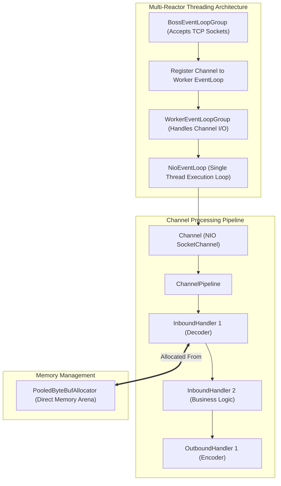

# Netty Framework Architecture & Deep-Dive Study Guide

A staff-engineer level study guide covering Netty internals: Multi-Reactor pattern, `BossEventLoopGroup` & `WorkerEventLoopGroup`, `ChannelPipeline` event propagation, Pooled `ByteBuf` memory management, and Zero-Copy mechanics.

---

## 📂 Chapters Index

| Chapter | Topic | Key Concepts | Location |
|---|---|---|---|
| **Chapter 1** | Reactor Pattern & EventLoop | Boss/Worker EventLoopGroup, `NioEventLoop` execution cycle, Thread affinity | [`ch01_reactor_pattern_and_eventloop.md`](./ch01_reactor_pattern_and_eventloop.md) |
| **Chapter 2** | ChannelPipeline, ByteBuf & Zero-Copy | Inbound/Outbound Handlers, Pooled Direct Memory, Jemalloc Allocator, Zero-Copy | [`ch02_channel_pipeline_bytebuf_and_zero_copy.md`](./ch02_channel_pipeline_bytebuf_and_zero_copy.md) |

---

## 🎨 Visual Overview: Netty Architecture Landscape



---

## ⚡ Netty Production Server Boilerplate (Java)

```java
public final class NettyEchoServer {
    private final int port;

    public NettyEchoServer(int port) { this.port = port; }

    public void start() throws Exception {
        // Boss Group: Accepts incoming connections
        EventLoopGroup bossGroup = new NioEventLoopGroup(1);
        // Worker Group: Handles I/O for accepted connections
        EventLoopGroup workerGroup = new NioEventLoopGroup(); // Defaults to CPU Cores * 2

        try {
            ServerBootstrap b = new ServerBootstrap();
            b.group(bossGroup, workerGroup)
             .channel(NioServerSocketChannel.class)
             .childHandler(new ChannelInitializer<SocketChannel>() {
                 @Override
                 protected void initChannel(SocketChannel ch) {
                     ChannelPipeline p = ch.pipeline();
                     p.addLast(new StringDecoder());
                     p.addLast(new StringEncoder());
                     p.addLast(new EchoServerHandler());
                 }
             })
             .option(ChannelOption.SO_BACKLOG, 128)
             .childOption(ChannelOption.SO_KEEPALIVE, true);

            ChannelFuture f = b.bind(port).sync();
            System.out.println("Netty Echo Server running on port " + port);
            f.channel().closeFuture().sync();
        } finally {
            bossGroup.shutdownGracefully();
            workerGroup.shutdownGracefully();
        }
    }
}
```
