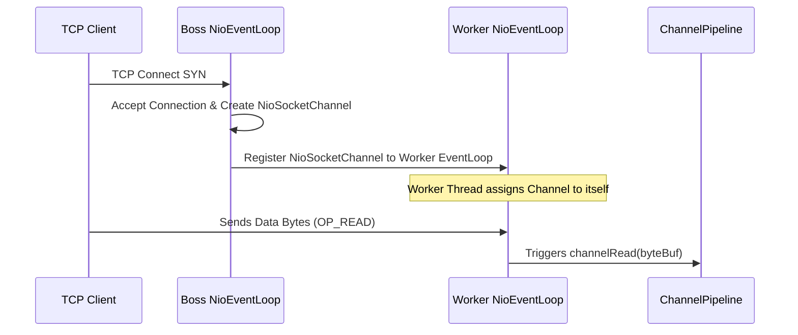
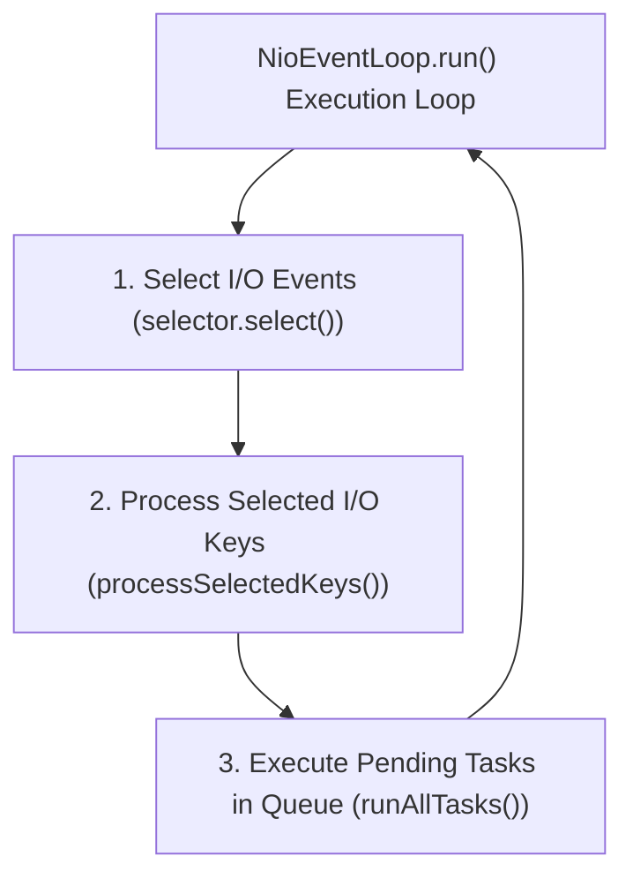

# Chapter 1: Reactor Pattern & EventLoop Architecture

Explores Doug Lea's **Reactor Pattern**, Netty's **Master-Worker Multi-Reactor Topology**, and `NioEventLoop` thread affinity.

---

## 📌 1. Reactor Pattern Evolution

### Single-Threaded Reactor vs Multi-Reactor Pattern

```mermaid
flowchart TD
    subgraph Single Reactor (Bottleneck on Multi-Core CPUs)
        R1["Reactor (select() + Dispatch)"] --> Accept1["Acceptor"]
        R1 --> Handler1["Handler (Decode + Compute + Encode)"]
    end

    subgraph Multi-Reactor Master-Worker (Netty Standard)
        MainReactor["Main Reactor / BossGroup (Accepts Sockets)"] --> SubReactor["Sub-Reactors / WorkerGroup (I/O & Handlers)"]
        SubReactor --> WorkerThread1["Worker Thread 1 (NioEventLoop 1)"]
        SubReactor --> WorkerThread2["Worker Thread 2 (NioEventLoop 2)"]
    end
```

---

## 📌 2. Netty EventLoop Group Hierarchy

- **`BossEventLoopGroup`**: Contains single (or small) `NioEventLoop` threads bound to `NioServerSocketChannel`. Accepts TCP client connections and registers new `NioSocketChannel` instances with a `WorkerEventLoopGroup`.
- **`WorkerEventLoopGroup`**: Contains multiple `NioEventLoop` threads (default: $2 \times N_{\text{CPU}}$). Handles all read, write, decode, and encode operations for assigned channels.



---

## 📌 3. `NioEventLoop` Execution Cycle & Thread Affinity

Each `NioEventLoop` is bound to a **single dedicated Java Thread** for its entire lifetime.



### 🧠 Why Netty Thread Affinity Matters
Because a `Channel` is registered to **exactly one `NioEventLoop` thread**, all `ChannelHandler` methods for that channel execute sequentially on that same thread!

> **Golden Guarantee**: You do NOT need explicit locks (`synchronized` or `ReentrantLock`) inside your `ChannelHandler` state variables, because Netty guarantees single-threaded event execution per channel!
