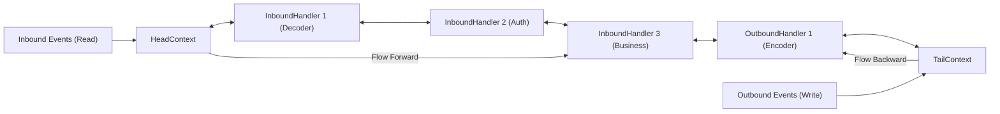

# Chapter 2: ChannelPipeline, ByteBuf & Zero-Copy

Deep dive into Netty's `ChannelPipeline` event handler chain, `ByteBuf` memory allocation, and kernel Zero-Copy mechanics.

---

## 📌 1. `ChannelPipeline` & Event Propagation

A `ChannelPipeline` is a doubly linked list of `ChannelHandler` nodes processing inbound and outbound I/O events.



- **Inbound Events** (Read, Active, Registered): Flow from **Head to Tail** (`ctx.fireChannelRead()`).
- **Outbound Events** (Write, Flush, Connect, Bind): Flow from **Tail to Head** (`ctx.write()`).

---

## 📌 2. `ByteBuf` Memory Management & Allocator

Standard Java `ByteBuffer` uses a single `position` and `limit`, requiring manual `.flip()` calls between reads and writes. Netty's `ByteBuf` uses two independent indices: **`readerIndex`** and **`writerIndex`**.

```
+-------------------+------------------+------------------+
| Discardable bytes |  Readable bytes  |  Writable bytes  |
|                   |     (CONTENT)    |                  |
+-------------------+------------------+------------------+
|                   |                  |                  |
0 <=          readerIndex <=     writerIndex <=    capacity
```

### Memory Allocation Types
- **Pooled vs Unpooled**: `PooledByteBufAllocator` pools memory chunks using Jemalloc-style arenas to minimize JVM GC pauses.
- **Heap vs Direct (`Unsafe`)**: Direct ByteBuf allocates off-heap memory via `sun.misc.Unsafe` / `ByteBuffer.allocateDirect()`, eliminating JNI buffer copies during OS socket I/O.

### Reference Counting (`ReferenceCounted`)
Direct memory buffers are not automatically managed by JVM GC. Netty uses explicit reference counting (`retain()` / `release()`):

```java
ByteBuf buf = ctx.alloc().directBuffer(256);
try {
    buf.writeBytes("Hello Netty".getBytes(StandardCharsets.UTF_8));
    // Process buf...
} finally {
    buf.release(); // Returns direct buffer back to Pooled Allocator Arena!
}
```

---

## 📌 3. Netty Zero-Copy Mechanics

Netty achieves **Zero-Copy** at both the application level and OS kernel level:

### 1. Application-Level Zero-Copy (`CompositeByteBuf` & `slice()`)
Combines multiple `ByteBuf` instances or slices an existing buffer into logical views without copying byte arrays in RAM.

```mermaid
flowchart TD
    subgraph CompositeByteBuf (Zero Application Memory Copy)
        Header["Header ByteBuf (20 Bytes)"]
        Payload["Payload ByteBuf (1024 Bytes)"]
        
        Composite["CompositeByteBuf (Logical Combined View)"]
    end

    Composite --> Header
    Composite --> Payload
```

```java
// Combining Header & Body without Memory Copy
CompositeByteBuf compositeBuf = Unpooled.compositeBuffer();
ByteBuf headerBuf = Unpooled.copiedBuffer("HEADER", StandardCharsets.UTF_8);
ByteBuf bodyBuf   = Unpooled.copiedBuffer("BODY DATA", StandardCharsets.UTF_8);

compositeBuf.addComponents(true, headerBuf, bodyBuf); // True consolidates indices!
```

### 2. Kernel-Level Zero-Copy (`DefaultFileRegion` / `sendfile`)
Uses Linux `sendfile()` system call to transfer file contents directly from OS page cache to socket buffer without copying data into user space RAM.

```java
// Serving static files with Kernel Zero-Copy
File file = new File("large_video.mp4");
FileRegion region = new DefaultFileRegion(new FileInputStream(file).getChannel(), 0, file.length());
ctx.writeAndFlush(region); // Invokes Linux sendfile()!
```
