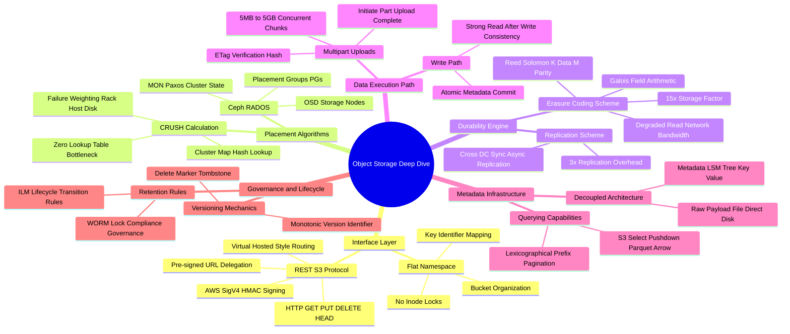

# Distributed Object Storage Architecture Mind Map

This document presents a structured visual breakdown of distributed object storage internals.

---

## 1. Visual Taxonomy

---

## 2. Component Reference Table

| Component | Responsibility | Bottlenecks & Operational Risks |
| :--- | :--- | :--- |
| **S3 Gateway Router** | Translates REST HTTP SigV4 requests to internal RPCs | High CPU consumption during SigV4 HMAC signature verification |
| **CRUSH Engine (Ceph)** | Calculates target OSD array from PG ID and Cluster Map | Excessive data rebalancing during large OSD cluster topology changes |
| **Erasure Encoder** | Generates $M$ parity chunks using Galois Field matrix math | High CPU utilization without SIMD (AVX-512/NEON) hardware acceleration |
| **Metadata Engine (RocksDB)** | Stores key-to-block mappings, ACLs, and object attributes | LSM compaction write amplification locking bucket prefix scans |
| **Multipart Assembler** | Manages chunk manifests and verifies part ETags | Abandoned un-completed multipart upload chunks wasting disk storage |
| **ILM Engine** | Scans buckets and executes tier transition policies | High metadata scan overhead on buckets with hundreds of millions of objects |
