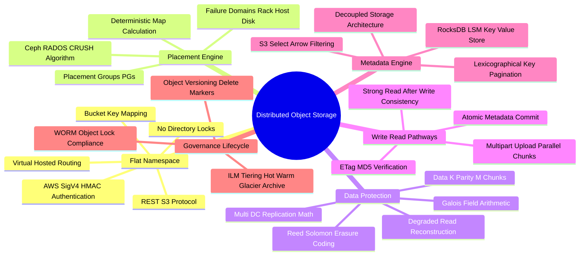

# Distributed Object Storage Technical Study Guide

Welcome to the **Distributed Object Storage Technical Study Guide**. This repository contains deep-dive chapters covering flat namespace architecture, REST S3 protocol mechanics (SigV4, pre-signed URLs), Ceph RADOS & the CRUSH algorithm, Reed-Solomon Erasure Coding ($K+M$) vs multi-DC replication, Strong Read-After-Write consistency models, Multipart upload internals, decoupled KV metadata engines (RocksDB/LSM), Object Versioning & WORM locks, and MinIO SIMD-accelerated operational tuning.

---

## 1. Executive Summary & Core Mechanics

Distributed Object Storage systems (such as Amazon S3, Ceph RADOS, MinIO, and OpenStack Swift) are engineered to store petabytes-to-exabytes of unstructured data (media files, database backups, machine learning datasets, data lake analytical tables) with high durability, linear scalability, and HTTP REST interface access.

Key Architectural Highlights:
* **Flat Namespace:** Eliminates hierarchical filesystem tree bottlenecks (POSIX inodes, directory locks) by organizing data into **Buckets** containing immutable **Keys** mapped directly to binary **Objects**.
* **CRUSH Algorithm (Ceph RADOS):** Computes object placement pseudo-randomly across storage nodes (OSDs) based on cluster maps, removing centralized lookup table bottlenecks.
* **Erasure Coding ($K+M$):** Encodes object data into $K$ data chunks and $M$ parity chunks using Galois Field arithmetic (Reed-Solomon), achieving high fault tolerance ($M$ drive failures) with drastically lower storage overhead ($1.5\times$) compared to $3\times$ replication.
* **Decoupled Data & Metadata Engines:** Separates raw binary payload storage (direct block/file I/O) from object metadata (LSM-tree Key-Value stores like RocksDB), enabling $O(1)$ object metadata operations and high-throughput streaming.
* **S3 Protocol Standard:** Universal HTTP REST API standard featuring SigV4 HMAC-SHA256 authentication, virtual-hosted routing, byte-range queries, and parallel multipart uploads.

---

## 2. Interactive Architecture Mind Map

---

## 3. Study Guide Chapter Index

| Chapter | Title | Focus Areas |
| :--- | :--- | :--- |
| **[00: Recommended Resources](00_Recommended_Books_and_Resources.md)** | Reading List & Reference Material | Amazon S3 Whitepapers, Ceph RADOS paper, MinIO architecture docs, OpenSource repos |
| **[00: Architecture Mind Map](00_Object_Storage_MindMap.md)** | Interactive Taxonomy | Visual breakdown of CRUSH, Erasure Coding, REST APIs, and Metadata engines |
| **[Chapter 1](ch01_architecture_flat_namespace_rest_api.md)** | Flat Namespace & REST S3 API Mechanics | POSIX vs Object Storage, S3 HTTP REST verbs, SigV4 signing, Virtual-Hosted vs Path routing |
| **[Chapter 2](ch02_ceph_rados_crush_algorithm.md)** | Ceph RADOS & The CRUSH Algorithm | OSDs, MONs (Paxos), MGRs, Placement Groups (PGs), deterministic map calculation without lookup tables |
| **[Chapter 3](ch03_erasure_coding_vs_replication.md)** | Erasure Coding & Replication Math | Reed-Solomon $K+M$, Galois Field $GF(2^8)$, $1.5\times$ vs $3\times$ storage overhead, degraded read repair cost |
| **[Chapter 4](ch04_write_read_path_consistency_models.md)** | Write/Read Paths & Multipart Uploads | Strong Read-After-Write consistency, payload streaming, Multipart upload (5MB-5GB chunking, ETag assembly) |
| **[Chapter 5](ch05_metadata_engines_rocksdb_kv.md)** | Decoupled Metadata & Indexing | RocksDB LSM metadata engine, bucket prefix pagination, S3 Select pushdown query filtering |
| **[Chapter 6](ch06_object_versioning_lifecycle_policies.md)** | Versioning, WORM & Lifecycle Policies | Monotonic `VersionId`, Delete markers, WORM Object Lock (Compliance vs Governance), ILM tier transitions |
| **[Chapter 7](ch07_minio_performance_tuning_diagnostics.md)** | MinIO Architecture & Performance Tuning | SIMD-accelerated erasure coding (AVX-512), `warp` benchmarking, `O_DIRECT`, kernel network sysctl tuning |

---

## 4. Quick Links & Navigation

* Return to [Master Tech-Stack Directory](../README.md)
* Next Chapter: **[Chapter 1: Flat Namespace Architecture & REST S3 Protocol Mechanics](ch01_architecture_flat_namespace_rest_api.md)**
