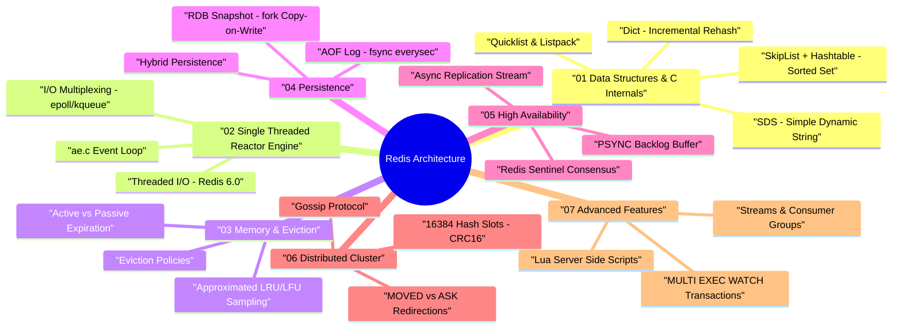

# Redis Architecture & Internals — Deep Dive Study Guide

> **Goal:** Master Redis internal architecture, C data structures, single-threaded event loop, memory eviction algorithms, persistence engines, Sentinel failover, and Cluster sharding for Staff Software Engineer system design.

---

## 🧠 Interactive Redis Architecture Mind Map

👉 **Full Mind Map & Taxonomy:** [`00_Redis_MindMap.md`](00_Redis_MindMap.md)  
📚 **Recommended Books & References:** [`00_Recommended_Books_and_Resources.md`](00_Recommended_Books_and_Resources.md)

---

## 📖 Chapter Index

1. **[Ch 1: Data Structures & Low-Level C Internals](ch01_data_structures_and_internals.md)** — SDS, Dict, SkipList, Quicklist, Intset, Radix Tree.
2. **[Ch 2: Single-Threaded Architecture & Event Loop](ch02_event_loop_and_architecture.md)** — Reactor Pattern, `epoll`/`kqueue`, `ae.c`, I/O Threads.
3. **[Ch 3: Memory Management & Eviction Policies](ch03_memory_management_and_eviction.md)** — Key Expiration, Approximated LRU/LFU, Memory Allocators.
4. **[Ch 4: Persistence Mechanisms (RDB, AOF & Hybrid)](ch04_persistence_rdb_and_aof.md)** — `fork()` Copy-on-Write, AOF Rewrite, `fsync` trade-offs.
5. **[Ch 5: High Availability (Replication & Redis Sentinel)](ch05_replication_and_sentinel.md)** — `PSYNC`, Replication Backlog, Sentinel SDOWN/ODOWN Failover.
6. **[Ch 6: Distributed Scale-Out (Redis Cluster)](ch06_redis_cluster_and_sharding.md)** — 16,384 Hash Slots, Gossip Protocol, Slot Resharding.
7. **[Ch 7: Transactions, Pub/Sub, Streams & Lua Scripting](ch07_transactions_pubsub_streams.md)** — `MULTI`/`EXEC`/`WATCH`, Streams vs Pub/Sub, Atomic Lua Scripts.
