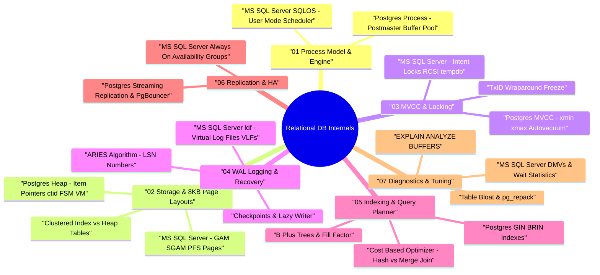

# Relational Database Architecture & Internals (PostgreSQL & MS SQL Server) — Deep Dive Study Guide

> **Goal:** Master relational database storage engines, 8KB page layouts, Multi-Version Concurrency Control (MVCC), Write-Ahead Logging (WAL/LSN), B+ Tree / GIN indexing, Cost-Based Query Optimizers, and High Availability for PostgreSQL and Microsoft SQL Server.

---

## 🧠 Interactive Relational DB Architecture Mind Map

👉 **Full Mind Map & Taxonomy:** [`00_RelationalDB_MindMap.md`](00_RelationalDB_MindMap.md)

---

## 📖 Chapter Index

1. **[Ch 1: Relational Process Models & Engine Architecture](ch01_process_architecture_sqlos.md)** — PostgreSQL process model (Postmaster, Shared Memory) vs MS SQL Server SQLOS (User-Mode Scheduler).
2. **[Ch 2: Storage Primitives & 8KB Page Layouts](ch02_page_layouts_heap_vs_clustered.md)** — 8KB page layouts, Postgres Heap Files (`ctid`, FSM, VM) vs MS SQL Server Clustered Index Tables.
3. **[Ch 3: MVCC, Locking & Concurrency Control](ch03_mvcc_locking_autovacuum.md)** — Postgres MVCC (`xmin`/`xmax`/Autovacuum & TxID freeze) vs MS SQL Server Lock Escalation & RCSI (`tempdb` version store).
4. **[Ch 4: Write-Ahead Logging (WAL / LSN) & Recovery](ch04_wal_recovery_checkpoints.md)** — PostgreSQL WAL (ARIES, LSN) vs MS SQL Server Transaction Log (`.ldf` & VLFs), Checkpoints.
5. **[Ch 5: Indexing Primitives & Cost-Based Query Optimizers](ch05_indexing_and_query_optimizer.md)** — B+ Trees, Postgres GIN/BRIN indexes, Cost-Based Optimizer (Nested Loop, Hash Join, Sort-Merge Join).
6. **[Ch 6: Replication, High Availability & Connection Pooling](ch06_replication_ha_pgbouncer.md)** — Physical Streaming Replication, Logical Replication, `PgBouncer`, MS SQL Server Always On AG.
7. **[Ch 7: Performance Tuning & Low-Level Diagnostics](ch07_performance_tuning_diagnostics.md)** — `EXPLAIN (ANALYZE, BUFFERS)`, `pg_stat_statements`, MS SQL Server DMVs & Wait Stats (`PAGEIOLATCH`), Table bloat.
