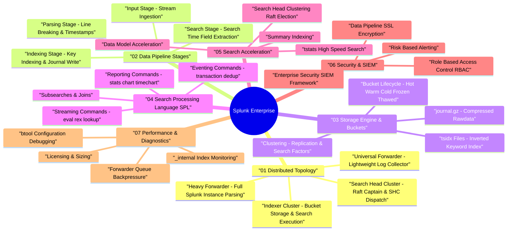

# Splunk Enterprise Architecture Taxonomy & Interactive Mind Map

Splunk Enterprise is a distributed log analytics, indexing, and SIEM (Security Information and Event Management) platform designed to ingest, parse, index, search, and visualize unstructured machine data at scale.

---

## 🧠 Interactive Splunk Architecture Mind Map

---

## 📊 Core Component Matrix

| Component | Topology Role | Primary Responsibility | Key Configuration Files |
| :--- | :--- | :--- | :--- |
| **Universal Forwarder (UF)** | Agent | Collects local log files and streams compressed data to Indexers | `inputs.conf`, `outputs.conf` |
| **Heavy Forwarder (HF)** | Intermediate Server | Parses, routes, masks, or filters log data before indexing | `props.conf`, `transforms.conf` |
| **Indexer** | Storage Node | Parses data, writes `.tsidx` index files and `journal.gz`, executes search jobs | `indexes.conf`, `props.conf` |
| **Search Head (SH)** | Frontend Node | Handles user search requests, dispatches search jobs to Indexers, aggregates results | `savedsearches.conf`, `authorize.conf` |
| **Manager Node (CM)** | Cluster Controller | Manages Indexer Cluster bucket replication factor (RF) and search factor (SF) | `server.conf` |
| **Deployment Server (DS)**| Management Node | Pushes configuration apps and updates to Universal/Heavy Forwarders | `serverclass.conf` |
