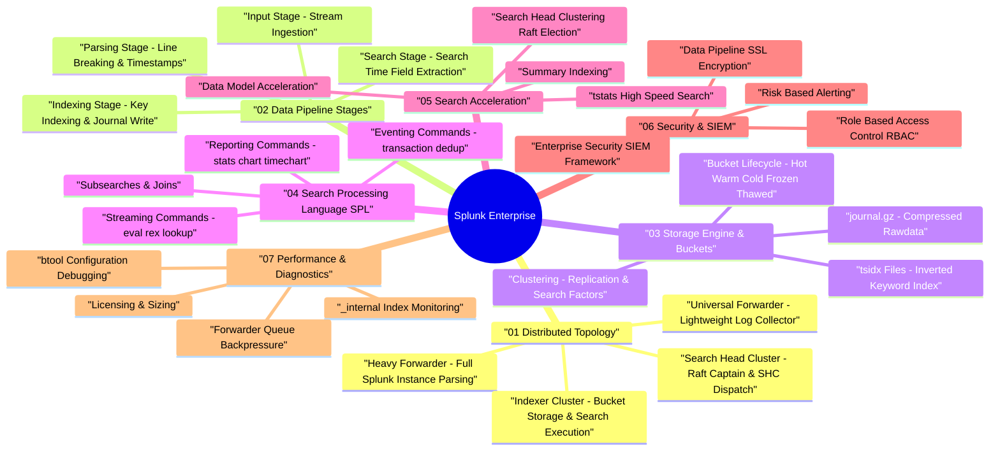

# Splunk Enterprise Architecture & Log Analytics Engine — Deep Dive Study Guide

> **Goal:** Master Splunk Enterprise distributed topologies, data pipeline stages (Parsing $\to$ Indexing $\to$ Search), `.tsidx` bucket storage lifecycles, Search Processing Language (SPL) query optimization, Search Head Clustering (SHC), Enterprise Security (SIEM), and operational performance tuning for Staff Software Engineering.

---

## 🧠 Interactive Splunk Architecture Mind Map

👉 **Full Mind Map & Taxonomy:** [`00_Splunk_MindMap.md`](00_Splunk_MindMap.md)  
📚 **Recommended Books & References:** [`00_Recommended_Books_and_Resources.md`](00_Recommended_Books_and_Resources.md)

---

## 📖 Chapter Index

1. **[Ch 1: Splunk Distributed Architecture & Topologies](ch01_architecture_forwarders_indexers.md)** — Universal Forwarders (UF) vs Heavy Forwarders (HF), Indexer Clusters, Search Head Clusters (SHC), Deployment Server, License Manager.
2. **[Ch 2: Splunk Data Pipeline & Event Processing](ch02_data_pipeline_parsing_indexing.md)** — 4 pipeline stages (Input $\to$ Parsing $\to$ Indexing $\to$ Search), `inputs.conf`, `props.conf`, `transforms.conf`, event line breaking (`LINE_BREAKER`), timestamp extraction (`TIME_PREFIX`/`TIME_FORMAT`).
3. **[Ch 3: Index Storage Engine, Bucket Lifecycle & `.tsidx` Files](ch03_index_storage_buckets_tsidx.md)** — Bucket lifecycle (`Hot` $\to$ `Warm` $\to$ `Cold` $\to$ `Frozen` $\to$ `Thawed`), rawdata journals (`journal.gz`), `.tsidx` inverted keyword index files, Replication & Search Factors (RF/SF).
4. **[Ch 4: Search Processing Language (SPL) & Query Engine](ch04_search_processing_language_spl.md)** — SPL execution model, streaming (`eval`, `rex`, `lookup`) vs reporting (`stats`, `chart`, `timechart`) vs eventing (`transaction`, `dedup`) commands, subsearches, joins.
5. **[Ch 5: Search Head Clustering & Query Acceleration](ch05_search_head_clustering_optimization.md)** — Search Head Cluster (SHC) Raft captain election, search job dispatching, Data Model Acceleration (DMA), `tstats` high-speed search, summary indexing.
6. **[Ch 6: Security, Enterprise Security (SIEM) & RBAC](ch06_security_siem_rbac.md)** — Splunk Enterprise Security (ES), Risk-Based Alerting (RBA), Role-Based Access Control (RBAC), index-level search filters, SSL/TLS pipeline encryption.
7. **[Ch 7: Operational Performance Tuning & Diagnostics](ch07_performance_tuning_diagnostics.md)** — `_internal` index diagnostics (`index=_internal sourcetype=splunkd`), `btool` configuration debugging, forwarder queue backpressure (`parsingQueue`/`indexQueue`), licensing usage alerts, bucket repair.
