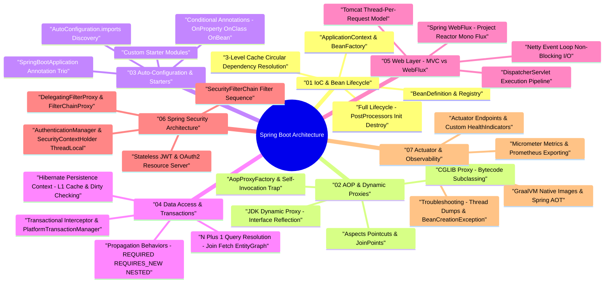

# Spring Framework & Spring Boot Architecture Taxonomy & Mind Map

Spring Framework and Spring Boot form the enterprise backbone of modern Java backend development, providing dependency injection, aspect-oriented programming, declarative transactions, auto-configuration, reactive web stacks, and enterprise security.

---

## 🧠 Interactive Spring Boot Architecture Mind Map

---

## 📊 Core Component Matrix

| Subsystem | Core Interfaces / Annotations | Primary Responsibility | Key Mechanism |
| :--- | :--- | :--- | :--- |
| **IoC Container** | `ApplicationContext`, `BeanPostProcessor`, `@Autowired` | Manages object instantiation, dependency injection, and scope lifecycles | Reflection, `BeanDefinitionRegistry`, 3-Level Cache |
| **AOP Engine** | `@Aspect`, `@Around`, `AopProxyFactory` | Decouples cross-cutting concerns (logging, security, metrics, transactions) | Dynamic Proxying (JDK Dynamic vs CGLIB) |
| **Auto-Configuration**| `@EnableAutoConfiguration`, `@ConditionalOnClass` | Automatically configures Spring beans based on classpath dependencies | `AutoConfiguration.imports` discovery |
| **Transaction Manager**| `@Transactional`, `PlatformTransactionManager` | Manages database transaction boundaries, commits, and rollbacks | AOP proxy wrapping, `TransactionSynchronizationManager` |
| **Web MVC** | `DispatcherServlet`, `@RestController` | Handles HTTP request routing, parameter binding, and response serialization | Servlet API, `HandlerMapping`, `HandlerAdapter` |
| **WebFlux** | `WebHandler`, `Mono<T>`, `Flux<T>` | Non-blocking reactive HTTP request handling | Reactive Streams, Project Reactor, Netty event loop |
| **Spring Security** | `SecurityFilterChain`, `AuthenticationManager` | Authenticates requests and authorizes access to endpoints and methods | Servlet Filter chain, `SecurityContextHolder` (`ThreadLocal`) |
