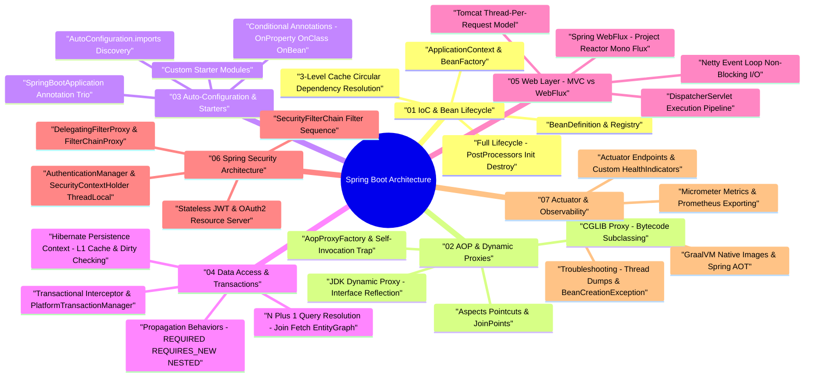

# Spring Framework & Spring Boot Architecture & Production Internals — Deep Dive Study Guide

> **Goal:** Master Spring IoC container mechanics, 3-level cache circular dependency resolution, AOP dynamic proxies (JDK vs CGLIB), Spring Boot auto-configuration & custom starters, `@Transactional` propagation behaviors, Spring MVC vs Reactive WebFlux, Spring Security filter chains, Actuator observability, GraalVM AOT native compilation, and production troubleshooting for Staff Software Engineering.

---

## 🧠 Interactive Spring Boot Architecture Mind Map

👉 **Full Mind Map & Taxonomy:** [`00_SpringBoot_MindMap.md`](00_SpringBoot_MindMap.md)  
📚 **Recommended Books & References:** [`00_Recommended_Books_and_Resources.md`](00_Recommended_Books_and_Resources.md)

---

## 📖 Chapter Index

1. **[Ch 1: Spring IoC Container & Bean Lifecycle](ch01_ioc_container_bean_lifecycle.md)** — `ApplicationContext` vs `BeanFactory`, `BeanDefinition`, full lifecycle phases, `BeanPostProcessor`, 3-Level Cache circular dependency resolution.
2. **[Ch 2: Aspect-Oriented Programming (AOP) & Proxy Architecture](ch02_aop_proxies_aspects.md)** — JDK Dynamic Proxies vs CGLIB, `@Aspect`, `@Around`, `JoinPoint`, `AopProxyFactory`, self-invocation trap & fixes.
3. **[Ch 3: Spring Boot Autoconfiguration & Starter Mechanics](ch03_spring_boot_autoconfiguration_starters.md)** — `@SpringBootApplication`, `AutoConfiguration.imports`, `@ConditionalOnProperty`, `@ConditionalOnClass`, `@ConditionalOnMissingBean`, building custom starters.
4. **[Ch 4: Data Access, Spring Data JPA & Transaction Management](ch04_spring_data_jpa_transactions.md)** — `@Transactional`, `PlatformTransactionManager`, propagation (`REQUIRED`, `REQUIRES_NEW`, `NESTED`), Hibernate L1/L2 cache, N+1 query resolution (`JOIN FETCH`, `EntityGraph`).
5. **[Ch 5: Web Layer: Spring MVC vs Spring WebFlux](ch05_spring_mvc_webflux_reactive.md)** — `DispatcherServlet` pipeline, Tomcat thread-per-request vs Project Reactor (`Mono`, `Flux`) Netty event-loop non-blocking I/O.
6. **[Ch 6: Spring Security Architecture & Filter Chain Mechanics](ch06_spring_security_architecture.md)** — `DelegatingFilterProxy`, `FilterChainProxy`, `SecurityFilterChain`, `AuthenticationManager`, `SecurityContextHolder` (`ThreadLocal`), JWT & OAuth2.
7. **[Ch 7: Spring Boot Actuator, Observability, GraalVM Native & Diagnostics](ch07_actuator_metrics_graalvm_troubleshooting.md)** — Actuator endpoints, Micrometer/Prometheus, GraalVM AOT native compilation, thread dump starvation analysis, and `BeanCreationException` debugging.
