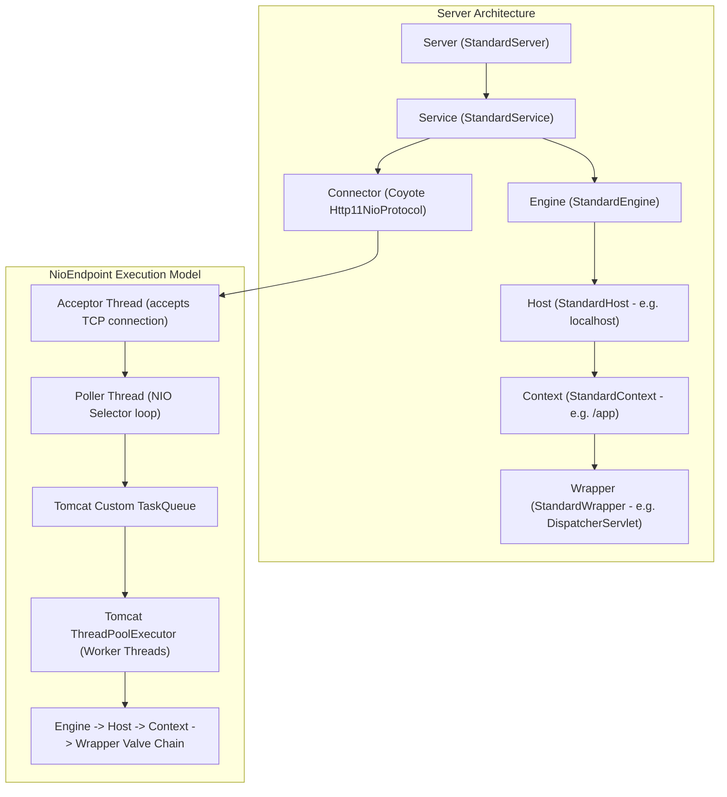

# Apache Tomcat Architecture & Deep-Dive Study Guide

A staff-engineer level study guide covering Apache Tomcat internals: Catalina Servlet Container, Coyote Protocol Handlers, `NioEndpoint` threading model, custom `ThreadPoolExecutor` overrides, and Servlet 3.0 Async Processing.

---

## 📂 Chapters Index

| Chapter | Topic | Key Concepts | Location |
|---|---|---|---|
| **Chapter 1** | Catalina & Coyote Architecture | Container Hierarchy, Lifecycle State Machine, Protocol Handlers, Valves | [`ch01_catalina_coyote_and_connector.md`](./ch01_catalina_coyote_and_connector.md) |
| **Chapter 2** | `NioEndpoint` & Threading Model | Acceptor/Poller Threads, Custom `TaskQueue` Override, Servlet 3.0 Async | [`ch02_thread_pool_and_nio_endpoint.md`](./ch02_thread_pool_and_nio_endpoint.md) |

---

## 🎨 Visual Overview: Tomcat Container & Threading Architecture



---

## ⚙️ Key Configuration Tuning Parameters (`server.xml`)

```xml
<Connector port="8080" 
           protocol="org.apache.coyote.http11.Http11NioProtocol"
           maxThreads="200"
           minSpareThreads="25"
           maxConnections="10000"
           acceptCount="100"
           connectionTimeout="20000"
           redirectPort="8443" />
```

| Parameter | Default | Meaning & Tuning Advice |
|---|---|---|
| `maxThreads` | 200 | Maximum worker threads in the Tomcat thread pool. Set based on CPU/Memory capacity ($N_{\text{threads}} = N_{\text{CPU}} \times (1 + W/C)$). |
| `minSpareThreads` | 10 | Minimum idle threads kept alive to handle sudden traffic spikes without creation latency. |
| `maxConnections` | 8192 (NIO) | Maximum number of concurrent TCP connections the server can accept and process simultaneously. |
| `acceptCount` | 100 | Length of OS OS-level TCP SYN listen queue (`backlog`). Extra incoming connection requests beyond this are rejected with "Connection Refused". |
| `connectionTimeout` | 20000 ms | Time Tomcat waits for request URI/headers after establishing a TCP socket connection before closing it. |
