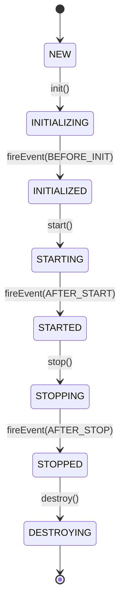
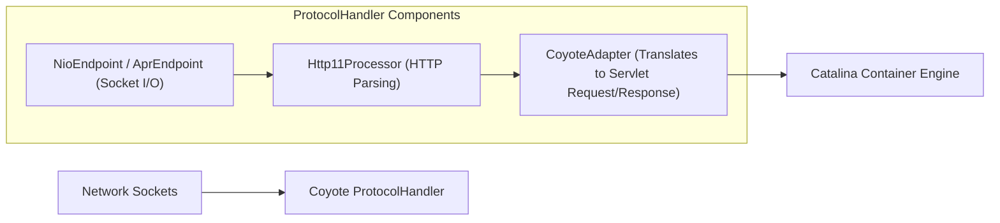
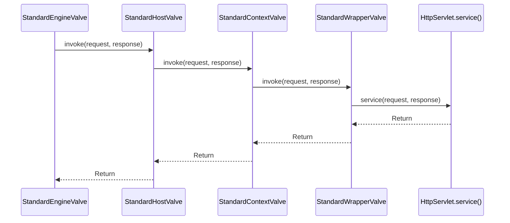

# Chapter 1: Catalina, Coyote & Connector Architecture

Explores the core architecture of Apache Tomcat: the **Catalina** Servlet Container, **Coyote** Connector, and the **Pipeline & Valve Chain**.

---

## 📌 1. Catalina Servlet Container & Lifecycle State Machine

Catalina manages the deployment, lifecycle, and invocation of Java Servlets. All components implement `org.apache.catalina.Lifecycle`.



### Component Hierarchy
1. **Server (`StandardServer`)**: Top-level container representing the entire Tomcat instance.
2. **Service (`StandardService`)**: Groups one or more `Connectors` to a single `Engine`.
3. **Engine (`StandardEngine`)**: Top-level request processing engine for a service.
4. **Host (`StandardHost`)**: Virtual host mapping (e.g. `www.example.com`).
5. **Context (`StandardContext`)**: Individual Web Application deployment (e.g. `/api`).
6. **Wrapper (`StandardWrapper`)**: Individual Servlet wrapper (`DispatcherServlet`).

---

## 📌 2. Coyote Connector Architecture

Coyote is Tomcat's HTTP/1.1 & HTTP/2 Connector component. It decouples network socket communication from Servlet request processing.



### Protocol Handler Variants
- **`org.apache.coyote.http11.Http11NioProtocol`**: Non-blocking I/O using Java NIO (`java.nio.channels.Selector`).
- **`org.apache.coyote.http11.Http11Nio2Protocol`**: Asynchronous I/O using Java NIO.2 (`AsynchronousSocketChannel`).
- **`org.apache.coyote.http11.Http11AprProtocol`**: Apache Portable Runtime (APR) using native C libraries and OpenSSL.

---

## 📌 3. Pipeline and Valve Chain

Every Catalina container level (`Engine`, `Host`, `Context`, `Wrapper`) has a `Pipeline` containing an ordered chain of `Valves` (similar to Java Servlet Filters or Netty `ChannelHandlers`).



### Custom Valve Example (Access Logging / Security Filter)
```java
package org.apache.catalina.valves;

import java.io.IOException;
import javax.servlet.ServletException;
import org.apache.catalina.connector.Request;
import org.apache.catalina.connector.Response;

public class CustomHeaderValve extends ValveBase {
    @Override
    public void invoke(Request request, Response response) throws IOException, ServletException {
        // Pre-processing
        response.setHeader("X-Powered-By", "Tomcat-Custom-Engine");
        
        // Pass to next Valve in Pipeline
        getNext().invoke(request, response);
        
        // Post-processing
    }
}
```
