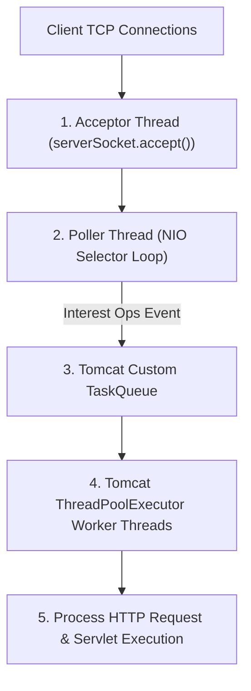
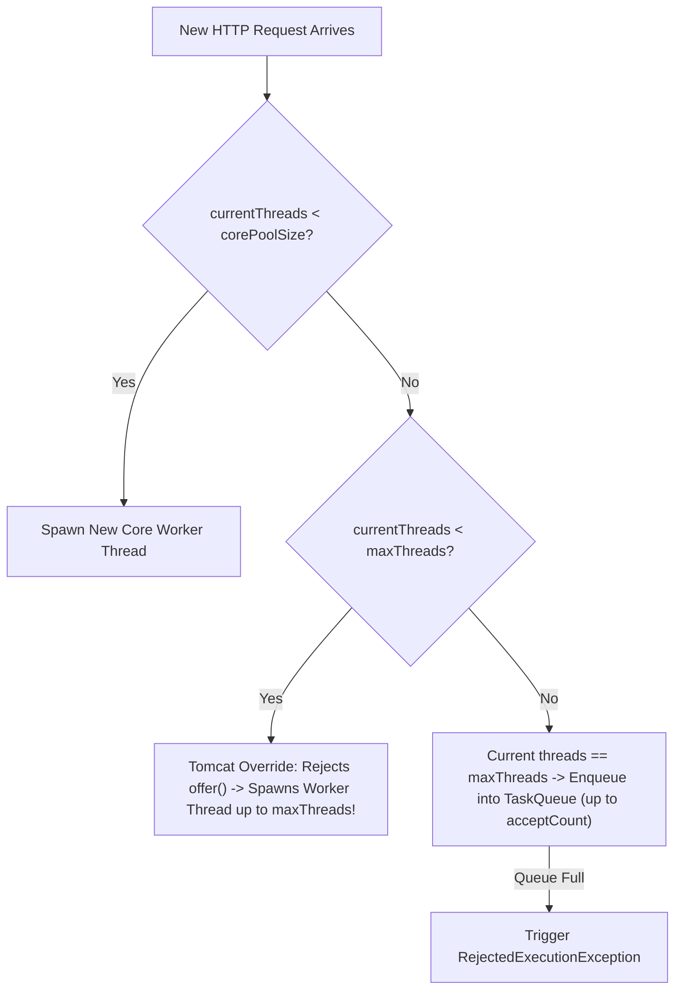
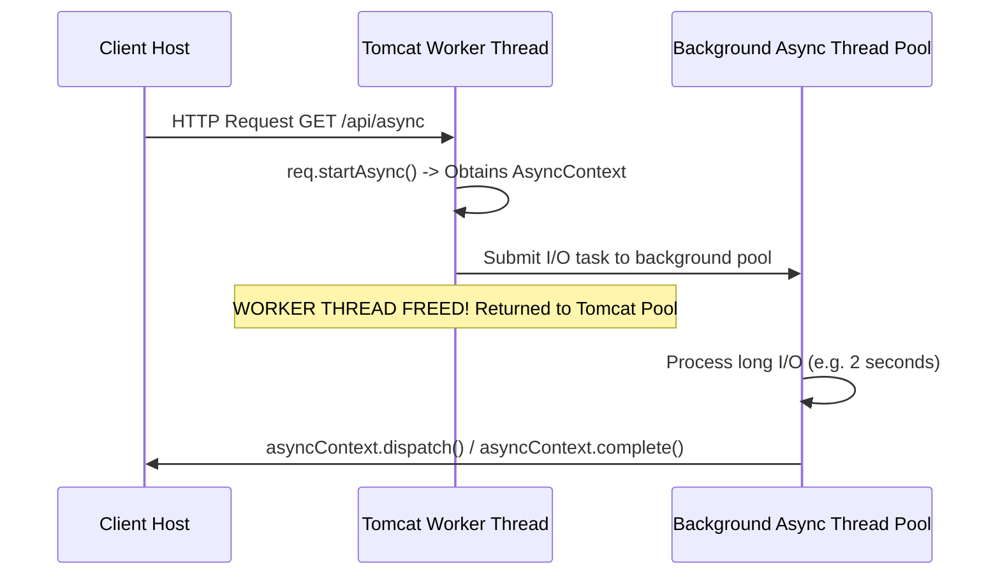

# Chapter 2: NioEndpoint, Thread Pool Overrides & Servlet 3.0 Async

Deep dive into Tomcat's `NioEndpoint` threading model, custom `TaskQueue` overrides, and Servlet 3.0 non-blocking async execution.

---

## 📌 1. Tomcat `NioEndpoint` Threading Architecture



### Key Components
1. **Acceptor Thread**: Runs a blocking `serverSocket.accept()` loop. Converts accepted raw sockets into `NioChannel` and registers them with a `Poller` thread.
2. **Poller Thread**: Runs a Java NIO `Selector.select()` loop. Monitors registered channels for read/write interest ops (`OP_READ`). When socket data arrives, it packages the socket into a `SocketProcessor` task and submits it to the thread pool.
3. **Worker Thread Pool**: Processes `SocketProcessor` tasks, parses HTTP request headers, and invokes the Servlet pipeline.

---

## 📌 2. Tomcat vs Standard `ThreadPoolExecutor` Task Queue Override

Standard Java `ThreadPoolExecutor` behaves as follows:
- If `currentThreads < corePoolSize`, create new thread.
- If `currentThreads >= corePoolSize`, **enqueue into `WorkQueue`**.
- If `WorkQueue` is full, **create new thread up to `maximumPoolSize`**.

### ⚠️ The Web Server Problem with Standard Java Behavior
If `corePoolSize = 10`, `maximumPoolSize = 200`, and `queueCapacity = 10000`:
A standard Java pool will queue 10,000 requests while using only 10 threads! It will **never expand to 200 threads** until the queue is completely full!

### ✅ Tomcat's Solution (`org.apache.tomcat.util.threads.TaskQueue`)
Tomcat overrides `TaskQueue.offer()` to reject queuing if current threads < `maxThreads`, forcing the executor to spawn worker threads up to `maxThreads` **BEFORE** storing tasks in the queue!



```java
// Simplified Tomcat TaskQueue.offer() Override Logic
@Override
public boolean offer(Runnable o) {
    if (parent == null) return super.offer(o);
    
    // If current thread count < maxThreads, force executor to spawn thread!
    if (parent.getPoolSize() < parent.getMaximumPoolSize()) {
        return false; // Returns false so ThreadPoolExecutor creates a new worker thread!
    }
    
    // If pool is at maxThreads, queue the task
    return super.offer(o);
}
```

---

## 📌 3. Servlet 3.0 Async Processing (`AsyncContext`)

Synchronous Servlets hold a Tomcat worker thread for the entire duration of the request, stalling worker pools during long-running backend I/O (e.g. Microservice REST calls or DB queries).

`AsyncContext` releases the Tomcat worker thread back to the pool while the background processing executes asynchronously!



### Servlet 3.0 Async Code Example
```java
@WebServlet(urlPatterns = "/api/async-data", asyncSupported = true)
public class AsyncDataServlet extends HttpServlet {
    private final ExecutorService asyncPool = Executors.newFixedThreadPool(50);

    @Override
    protected void doGet(HttpServletRequest req, HttpServletResponse resp) {
        // Start Async Context -> Releases Tomcat worker thread immediately!
        final AsyncContext asyncContext = req.startAsync();
        asyncContext.setTimeout(5000); // 5s timeout

        asyncPool.submit(() -> {
            try {
                // Perform heavy I/O without blocking Tomcat worker threads
                String result = fetchExternalData();
                
                HttpServletResponse response = (HttpServletResponse) asyncContext.getResponse();
                response.setContentType("application/json");
                response.getWriter().write(result);
            } catch (Exception e) {
                // handle error
            } finally {
                asyncContext.complete(); // Complete response!
            }
        });
    }
}
```
