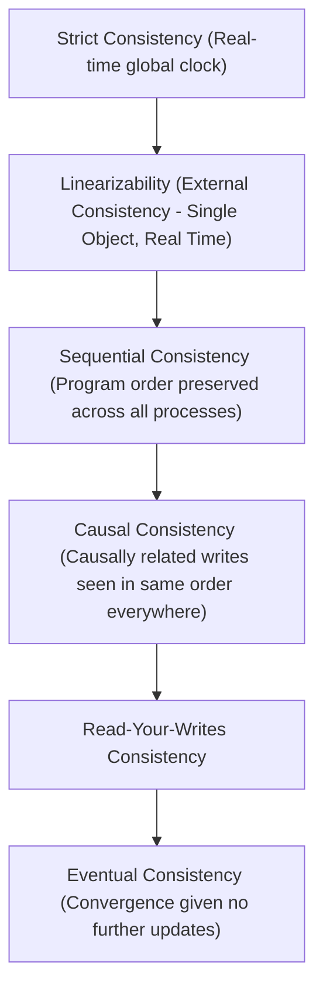

# 00. Distributed Systems Cheatsheet & Trade-off Matrix

A high-density reference guide summarizing fundamental distributed systems theorems, consistency models, resiliency patterns, and timing mechanisms.

---

## ⚖️ CAP & PACELC Theorem Decision Matrix

### 1. CAP Theorem (Eric Brewer)
In the presence of a **Network Partition ($P$)**, a distributed system must choose between:
- **Consistency ($C$)**: Every read receives the most recent write or an error.
- **Availability ($A$)**: Every non-failing node returns a non-error response (without guaranteeing it contains the most recent write).

### 2. PACELC Theorem (Daniel Abadi)
Extends CAP to describe behavior during normal (non-partitioned) execution:
$$\text{If } \mathbf{P} \text{ (Partition): } \mathbf{A} \text{ vs } \mathbf{C}, \quad \text{Else } (\mathbf{E}): \mathbf{L} \text{ (Latency) vs } \mathbf{C} \text{ (Consistency)}$$

| System | Partition Behavior ($P$) | Normal Behavior ($E$) | PACELC Classification | Typical Use Case |
| :--- | :--- | :--- | :--- | :--- |
| **Apache Cassandra / DynamoDB** | Availability ($A$) | Latency ($L$) | **PA/EL** | High-throughput writes, event logs, time-series |
| **MongoDB / HBase** | Consistency ($C$) | Consistency ($C$) | **PC/EC** | Document management, strict record lookup |
| **Google Spanner / CockroachDB** | Consistency ($C$) | Latency ($L$) | **PC/EC** (with bounded TrueTime latency) | Financial ledgers, multi-region transactions |
| **Redis (Single Instance / Cluster)** | Availability ($A$) | Latency ($L$) | **PA/EL** | Ephemeral caching, session store |

---

## 🏛️ Consistency Models Hierarchy

| Consistency Model | Description | Guarantees | Trade-offs |
| :--- | :--- | :--- | :--- |
| **Linearizability** | Operations appear to take effect instantaneously at a single point in time between invocation and response. | Strongest single-object guarantee. Reads always reflect the latest write. | High latency, requires consensus (Raft/Paxos) or atomic clocks (TrueTime). |
| **Sequential** | Operations take effect in some sequential order consistent across all nodes, respecting per-process program order. | Order is deterministic across all nodes. | Does not guarantee real-time clock alignment. |
| **Causal** | Operations that are causally related are seen in the same order by every node. Concurrent operations may be seen in different order. | Prevents causality violations (e.g. comment appearing before post). | Lower latency than linearizability; requires tracking vector clocks/version vectors. |
| **Eventual** | If no new updates are made, all replicas will eventually converge to identical state. | Maximum availability, minimal latency. | Temporary stale reads, requires conflict resolution (LWW, CRDTs). |

---

## 🛡️ Resiliency & Fault Tolerance Patterns Matrix

| Pattern | Problem Addressed | Core Mechanism | Key Parameters |
| :--- | :--- | :--- | :--- |
| **Circuit Breaker** | Cascading failure from failing downstream services. | Monitors failure rate. Transitions between `CLOSED` $\rightarrow$ `OPEN` $\rightarrow$ `HALF-OPEN`. | Failure threshold %, evaluation window, sleep duration. |
| **Exponential Backoff + Jitter** | Thundering herd problem during service recovery. | Retries failed requests with exponentially increasing delay plus random jitter. | Base delay ($t_0$), max delay ($t_{\text{max}}$), jitter factor ($\pm 50\%$). |
| **Bulkhead** | One failing pool exhausting all application threads. | Isolates resource pools (thread pools, semaphores) per downstream service. | Max concurrent calls, queue capacity. |
| **Idempotency Key** | Duplicate processing of retried state-changing requests. | Client passes unique ID (`X-Idempotency-Key`). Server caches response in Redis. | Key TTL (e.g. 24h), lock scope. |
| **Rate Limiter** | Resource depletion and Denial of Service (DoS). | Restricts request volume per client/IP using Sliding Window or Token Bucket. | Capacity $C$, refill rate $r$, window size $W$. |

---

## ⏱️ Time & Ordering Mechanisms Comparison

| Mechanism | Type | Scalability | Conflict Resolution | Best Used For |
| :--- | :--- | :--- | :--- | :--- |
| **NTP (Network Time Protocol)** | Physical Clock | High | Wall-clock comparison (subject to clock drift/skew) | Logging, metrics timestamps (NOT for ordering state) |
| **TrueTime (Google Spanner)** | Physical + Hardware | High | Bounded uncertainty window $[\text{earliest}, \text{latest}]$ with atomic GPS/rubidium clocks | Multi-region linearizable transactions |
| **Lamport Timestamps** | Logical Clock | High | Total ordering via integer counter + Process ID | Event ordering without physical time alignment |
| **Vector Clocks** | Logical Clock | Medium (grows with node count) | Detects causality vs concurrency ($V_A < V_B$ or $V_A \parallel V_B$) | Distributed key-value stores (Dynamo, Riak) |
| **Hybrid Logical Clocks (HLC)** | Physical + Logical | High | Combines physical wall clock with logical counter | CockroachDB, MongoDB transaction tracking |
