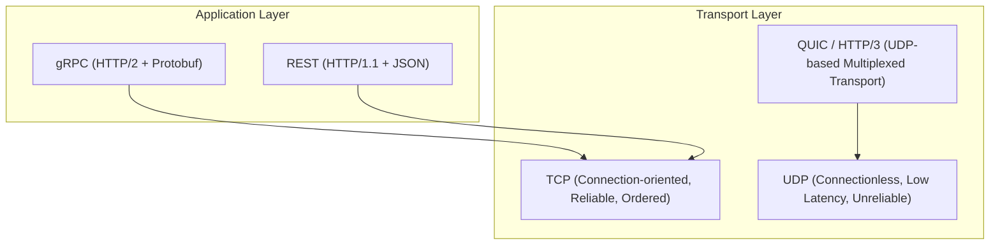
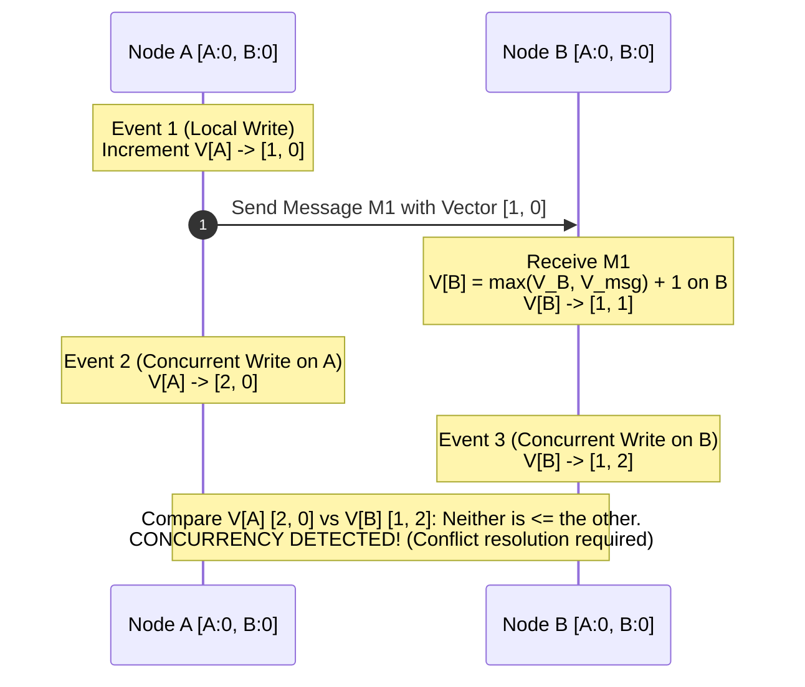

# 01. Network Protocols, RPC & Clocks

This chapter examines communication protocols in distributed systems, gRPC/Protobuf efficiency, physical time drift, and logical clocks (Lamport & Vector Clocks) for tracking causality without a global physical clock.

---

## 📡 Transport & Messaging Protocols

Distributed systems rely on network protocols to exchange data across network boundaries.



### 📊 Protocol Comparison

| Protocol | Transport | Serialization | Multiplexing | Latency | Use Case |
| :--- | :--- | :--- | :--- | :--- | :--- |
| **REST (HTTP/1.1)** | TCP | JSON / Text | Head-of-Line Blocking per TCP Connection | Medium | External Public APIs, Web Clients |
| **gRPC (HTTP/2)** | TCP | Protocol Buffers (Binary) | Full Single-Connection Stream Multiplexing | Low | Microservice-to-Microservice internal RPCs |
| **HTTP/3 (QUIC)** | UDP | Binary / Protobuf / JSON | Independent Stream Multiplexing (No HoL Blocking) | Very Low | Mobile apps, erratic wireless networks |

---

## ⏱️ Time in Distributed Systems: Physical vs Logical Clocks

Physical clocks (OS system time synchronized via NTP) cannot be relied upon for strict event ordering in distributed systems due to **clock drift**, **clock skew**, and **NTP leap second adjustments**.

### 1. Lamport Timestamps
Provides a **partial ordering** of events using a scalar counter incremented locally and passed in message metadata:
$$L(e_b) = \max(L(e_a), L(m)) + 1$$

*Limitations*: If $L(a) < L(b)$, we **cannot** infer that event $a$ causally preceded event $b$.

### 2. Vector Clocks
Solves Lamport timestamp limitations by maintaining a vector of counters $V$ of size $N$ (where $N$ is the number of nodes in the cluster). Vector clocks enable exact detection of **causal precedence** versus **concurrent updates**.



---

## ☕ Production Java Implementation: Thread-Safe Vector Clock & Causality Evaluator

```java
package com.example.distributed.clock;

import java.util.*;
import java.util.concurrent.ConcurrentHashMap;
import java.util.concurrent.atomic.AtomicLong;

/**
 * Thread-safe implementation of Vector Clocks for causality tracking.
 */
public class VectorClock implements Comparable<VectorClock> {

    public enum CausalityRelation {
        EQUAL,
        BEFORE,
        AFTER,
        CONCURRENT // Conflict detected!
    }

    private final String nodeId;
    private final Map<String, Long> clockMap;

    public VectorClock(String nodeId) {
        this.nodeId = Objects.requireNonNull(nodeId, "nodeId cannot be null");
        this.clockMap = new ConcurrentHashMap<>();
        this.clockMap.put(nodeId, 0L);
    }

    public VectorClock(String nodeId, Map<String, Long> initialMap) {
        this.nodeId = nodeId;
        this.clockMap = new ConcurrentHashMap<>(initialMap);
        this.clockMap.putIfAbsent(nodeId, 0L);
    }

    /**
     * Increments the local process counter for a local event.
     */
    public synchronized void increment() {
        clockMap.put(nodeId, clockMap.getOrDefault(nodeId, 0L) + 1);
    }

    /**
     * Merges an incoming vector clock from another node (on receiving a message).
     */
    public synchronized void merge(VectorClock incomingClock) {
        // 1. Take element-wise maximum across all node counters
        for (Map.Entry<String, Long> entry : incomingClock.clockMap.entrySet()) {
            String remoteNode = entry.getKey();
            Long remoteVal = entry.getValue();
            clockMap.merge(remoteNode, remoteVal, Math::max);
        }
        // 2. Increment local process clock
        increment();
    }

    /**
     * Compares this vector clock with another to determine causal relationship.
     */
    public CausalityRelation compareCausality(VectorClock other) {
        Set<String> allNodes = new HashSet<>(this.clockMap.keySet());
        allNodes.addAll(other.clockMap.keySet());

        boolean isLessOrEqual = true;
        boolean isGreaterOrEqual = true;

        for (String node : allNodes) {
            long val1 = this.clockMap.getOrDefault(node, 0L);
            long val2 = other.clockMap.getOrDefault(node, 0L);

            if (val1 < val2) {
                isGreaterOrEqual = false;
            }
            if (val1 > val2) {
                isLessOrEqual = false;
            }
        }

        if (isLessOrEqual && isGreaterOrEqual) {
            return CausalityRelation.EQUAL;
        } else if (isLessOrEqual) {
            return CausalityRelation.BEFORE; // This happened causally before Other
        } else if (isGreaterOrEqual) {
            return CausalityRelation.AFTER; // This happened causally after Other
        } else {
            return CausalityRelation.CONCURRENT; // Neither dominates -> Concurrent conflict!
        }
    }

    public Map<String, Long> getClockMap() {
        return Collections.unmodifiableMap(new HashMap<>(clockMap));
    }

    public String getNodeId() {
        return nodeId;
    }

    @Override
    public int compareTo(VectorClock o) {
        CausalityRelation relation = compareCausality(o);
        return switch (relation) {
            case BEFORE -> -1;
            case AFTER -> 1;
            default -> 0; // EQUAL or CONCURRENT
        };
    }

    @Override
    public String toString() {
        return "VectorClock{" + "nodeId='" + nodeId + '\'' + ", clocks=" + clockMap + '}';
    }
}
```
