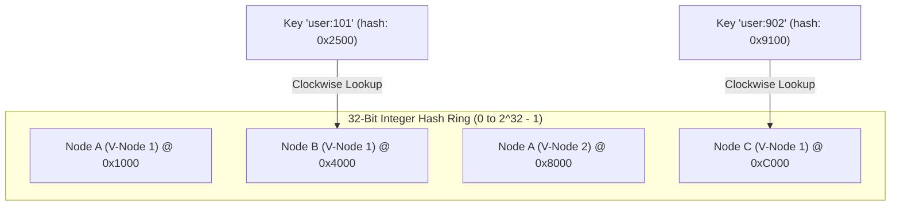
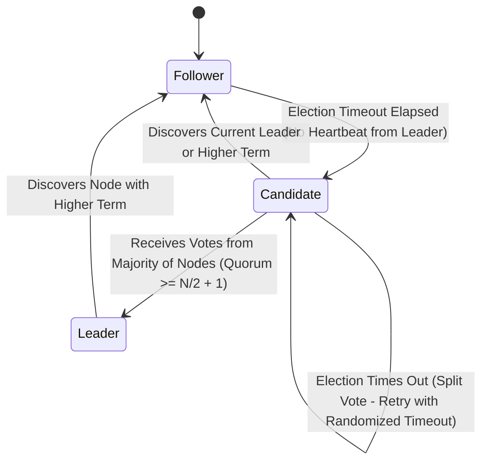

# 02. Sharding, Replication & Consensus

This chapter covers horizontal data partitioning (Consistent Hashing), replication strategies for high availability, and consensus algorithms (Raft) for distributed state machine replication.

---

## ⭕ Consistent Hashing with Virtual Nodes

Traditional hash partitioning ($\text{node} = \text{hash}(key) \pmod N$) forces nearly $100\%$ of keys to remap whenever the cluster size $N$ changes. **Consistent Hashing** maps both keys and storage nodes to a circular 32-bit hash ring, ensuring that adding or removing a node only reassigns $K/N$ keys (where $K$ is the total number of keys).

### 🌀 Hash Ring Layout & Virtual Nodes



> **Virtual Nodes (V-Nodes)**: Each physical machine is mapped to $V$ locations on the ring (e.g. $V=256$). This prevents hot-spot imbalances across heterogeneous physical hardware and guarantees uniform data distribution.

---

## ☕ Production Java Implementation: Consistent Hash Ring with Virtual Nodes

```java
package com.example.distributed.sharding;

import java.nio.charset.StandardCharsets;
import java.security.MessageDigest;
import java.security.NoSuchAlgorithmException;
import java.util.*;
import java.util.concurrent.ConcurrentSkipListMap;

/**
 * Consistent Hash Ring supporting virtual nodes and Murmur3 / MD5 hashing.
 */
public class ConsistentHashRing<T> {

    private final int numberOfReplicas; // Virtual nodes per physical node
    private final ConcurrentSkipListMap<Long, T> circle = new ConcurrentSkipListMap<>();

    public ConsistentHashRing(int numberOfReplicas, Collection<T> nodes) {
        this.numberOfReplicas = numberOfReplicas;
        if (nodes != null) {
            for (T node : nodes) {
                addNode(node);
            }
        }
    }

    /**
     * Adds a physical node by generating N virtual node positions on the ring.
     */
    public synchronized void addNode(T node) {
        for (int i = 0; i < numberOfReplicas; i++) {
            String vNodeKey = node.toString() + "-vnode-" + i;
            long hash = hash(vNodeKey);
            circle.put(hash, node);
        }
    }

    /**
     * Removes a physical node and all its associated virtual nodes.
     */
    public synchronized void removeNode(T node) {
        for (int i = 0; i < numberOfReplicas; i++) {
            String vNodeKey = node.toString() + "-vnode-" + i;
            long hash = hash(vNodeKey);
            circle.remove(hash);
        }
    }

    /**
     * Resolves the primary physical node responsible for a given key.
     */
    public T getNode(String key) {
        if (circle.isEmpty()) {
            return null;
        }
        long hash = hash(key);

        // Find the first virtual node with hash >= key hash
        Long targetHash = circle.ceilingKey(hash);
        if (targetHash == null) {
            // Wrap around to the beginning of the ring
            targetHash = circle.firstKey();
        }
        return circle.get(targetHash);
    }

    /**
     * Computes a 64-bit hash using MD5 (or Murmur3).
     */
    private long hash(String key) {
        try {
            MessageDigest md = MessageDigest.getInstance("MD5");
            byte[] digest = md.digest(key.getBytes(StandardCharsets.UTF_8));
            // Convert first 8 bytes of MD5 digest to long
            return ((long) (digest[7] & 0xFF) << 56)
                 | ((long) (digest[6] & 0xFF) << 48)
                 | ((long) (digest[5] & 0xFF) << 40)
                 | ((long) (digest[4] & 0xFF) << 32)
                 | ((long) (digest[3] & 0xFF) << 24)
                 | ((long) (digest[2] & 0xFF) << 16)
                 | ((long) (digest[1] & 0xFF) << 8)
                 | ((long) (digest[0] & 0xFF));
        } catch (NoSuchAlgorithmException e) {
            throw new RuntimeException("MD5 digest unavailable", e);
        }
    }

    public int getRingSize() {
        return circle.size();
    }
}
```

---

## 🗳️ Consensus Algorithms: Raft Protocol Deep Dive

Distributed state machine replication requires consensus among a group of nodes, ensuring correctness under up to $F$ node failures in a cluster of $2F + 1$ nodes.

### Raft Finite State Machine & State Transitions



### 📜 Raft Guarantees & Safety Invariants

1. **Election Safety**: At most one leader can be elected per term.
2. **Leader Append-Only**: A leader never overwrites or truncates its log entries; it only appends new entries.
3. **Log Matching**: If two logs contain an entry with the same index and term, then the logs are identical in all entries up through the given index.
4. **Leader Completeness**: If a log entry is committed in a given term, that entry will be present in the logs of the leaders for all higher-numbered terms.
5. **State Machine Safety**: If a server has applied a log entry at a given index to its state machine, no other server will ever apply a different log entry for the same index.

---

## 🔄 Replication Topologies Comparison

| Topology | Write Path | Read Path | Conflict Handling | Example |
| :--- | :--- | :--- | :--- | :--- |
| **Single-Leader** | Single Primary Node | Primary or Async Replicas | None (Leader defines total order) | PostgreSQL, MySQL, Redis Primary-Replica |
| **Multi-Leader** | Any Designated Leader Node | Local Leader Replica | Operational Transformation, LWW, CRDTs | Multi-region MySQL, CouchDB |
| **Leaderless (Dynamo)** | Any $W$ Nodes out of $N$ | Any $R$ Nodes out of $N$ ($R+W > N$) | Read Repair, Hinted Handoff, Vector Clocks | Apache Cassandra, Amazon DynamoDB |
