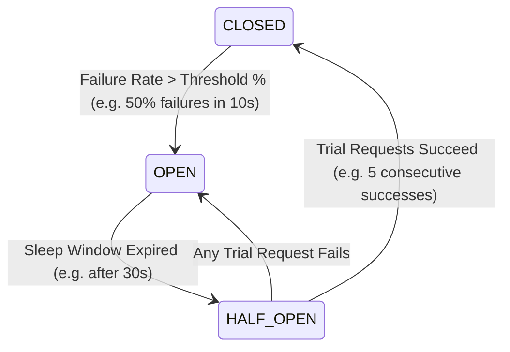
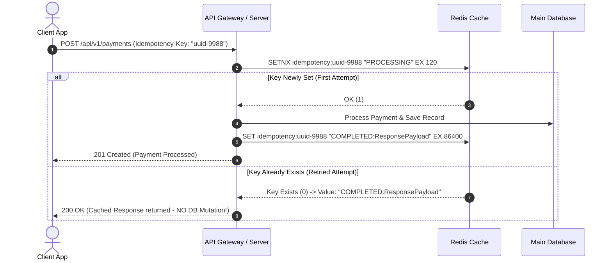

# 03. Fault Models, Retries & Resiliency Patterns

This chapter details strategies for building fault-tolerant distributed systems capable of surviving partial hardware outages, network partitions, and cascading service failures.

---

## ⚡ Distributed Fault Models

Distributed systems operate under various failure modes:

| Fault Model | Node Behavior | Network Behavior | Mitigation Strategy |
| :--- | :--- | :--- | :--- |
| **Crash-Stop (Fail-Stop)** | A node halts permanently upon failure. | Messages sent before crash are delivered. | Redundant failover replicas, health checks. |
| **Crash-Recovery** | A node crashes, loses volatile RAM state, but recovers from disk. | Messages may be lost or delayed during crash. | Write-Ahead Logging (WAL), persistent state recovery. |
| **Byzantine Fault** | Nodes may act arbitrarily, maliciously, or send conflicting data. | Messages can be altered, forged, or replayed. | Byzantine Fault Tolerant (BFT) consensus (PBFT, Tendermint). |

---

## 🔄 Circuit Breaker Pattern

A **Circuit Breaker** prevents an application from repeatedly calling a downstream dependency that is known to be failing, preserving system threads and avoiding thundering-herd degradation.



---

## ☕ Production Java Implementation: Thread-Safe Sliding-Window Circuit Breaker

```java
package com.example.distributed.resiliency;

import java.util.concurrent.atomic.AtomicInteger;
import java.util.concurrent.atomic.AtomicLong;
import java.util.concurrent.atomic.AtomicReference;
import java.util.function.Supplier;

/**
 * Production-grade Sliding-Window Circuit Breaker.
 */
public class CircuitBreaker {

    public enum State {
        CLOSED,
        OPEN,
        HALF_OPEN
    }

    private final AtomicReference<State> state = new AtomicReference<>(State.CLOSED);
    private final int failureThresholdPercentage;
    private final long sleepWindowMillis;
    private final int minimumRingBufferSize;

    private final AtomicLong lastStateChangeTimestamp = new AtomicLong(System.currentTimeMillis());
    private final AtomicInteger successCount = new AtomicInteger(0);
    private final AtomicInteger failureCount = new AtomicInteger(0);

    public CircuitBreaker(int failureThresholdPercentage, long sleepWindowMillis, int minimumRingBufferSize) {
        this.failureThresholdPercentage = failureThresholdPercentage;
        this.sleepWindowMillis = sleepWindowMillis;
        this.minimumRingBufferSize = minimumRingBufferSize;
    }

    /**
     * Executes a supplier operation wrapped in circuit breaker protection.
     */
    public <T> T executeSupplier(Supplier<T> supplier) throws Exception {
        checkStateTransition();

        if (state.get() == State.OPEN) {
            throw new CircuitBreakerOpenException("Circuit breaker is OPEN. Request blocked.");
        }

        try {
            T result = supplier.get();
            onSuccess();
            return result;
        } catch (Exception e) {
            onFailure();
            throw e;
        }
    }

    private void onSuccess() {
        if (state.get() == State.HALF_OPEN) {
            if (successCount.incrementAndGet() >= 5) { // 5 consecutive successes to recover
                resetAndTransitionTo(State.CLOSED);
            }
        } else if (state.get() == State.CLOSED) {
            successCount.incrementAndGet();
        }
    }

    private void onFailure() {
        failureCount.incrementAndGet();
        if (state.get() == State.HALF_OPEN) {
            resetAndTransitionTo(State.OPEN);
        } else if (state.get() == State.CLOSED) {
            evaluateFailureRate();
        }
    }

    private void evaluateFailureRate() {
        int total = successCount.get() + failureCount.get();
        if (total >= minimumRingBufferSize) {
            int failRate = (failureCount.get() * 100) / total;
            if (failRate >= failureThresholdPercentage) {
                resetAndTransitionTo(State.OPEN);
            }
        }
    }

    private void checkStateTransition() {
        if (state.get() == State.OPEN) {
            long elapsed = System.currentTimeMillis() - lastStateChangeTimestamp.get();
            if (elapsed >= sleepWindowMillis) {
                if (state.compareAndSet(State.OPEN, State.HALF_OPEN)) {
                    lastStateChangeTimestamp.set(System.currentTimeMillis());
                    successCount.set(0);
                    failureCount.set(0);
                }
            }
        }
    }

    private void resetAndTransitionTo(State newState) {
        state.set(newState);
        lastStateChangeTimestamp.set(System.currentTimeMillis());
        successCount.set(0);
        failureCount.set(0);
    }

    public State getState() {
        return state.get();
    }

    public static class CircuitBreakerOpenException extends RuntimeException {
        public CircuitBreakerOpenException(String message) {
            super(message);
        }
    }
}
```

---

## 🎲 Exponential Backoff with Decorrelated Jitter

Simple retries without jitter synchronize client retry attempts, leading to **retry storms**.

### Decorrelated Jitter Algorithm

```python
import random
import time

def execute_with_retry(func, max_retries=5, base_delay=0.1, max_delay=10.0):
    """
    Executes a function with Decorrelated Jitter retries:
    sleep = min(max_delay, random.uniform(base_delay, sleep * 3))
    """
    sleep_time = base_delay
    for attempt in range(1, max_retries + 1):
        try:
            return func()
        except Exception as e:
            if attempt == max_retries:
                raise e
            
            # Compute decorrelated jitter sleep duration
            sleep_time = min(max_delay, random.uniform(base_delay, sleep_time * 3))
            time.sleep(sleep_time)
```

---

## 🔑 Idempotency Keys Pattern

To safely retry state-changing HTTP operations (`POST /api/v1/payments`), clients pass a unique `Idempotency-Key` header.


