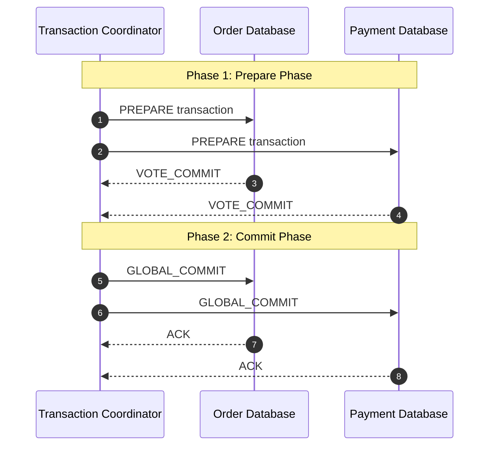
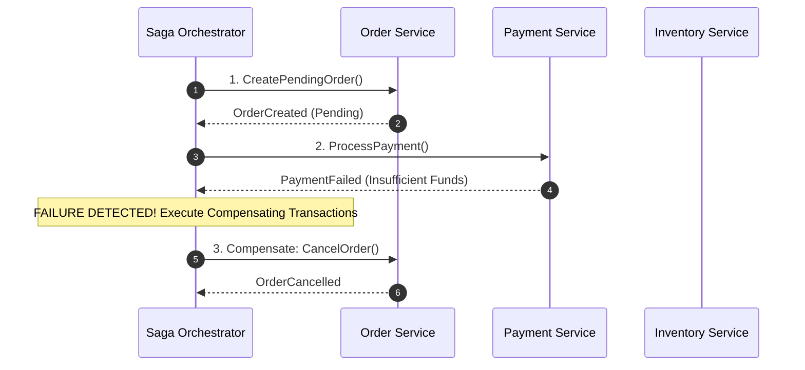
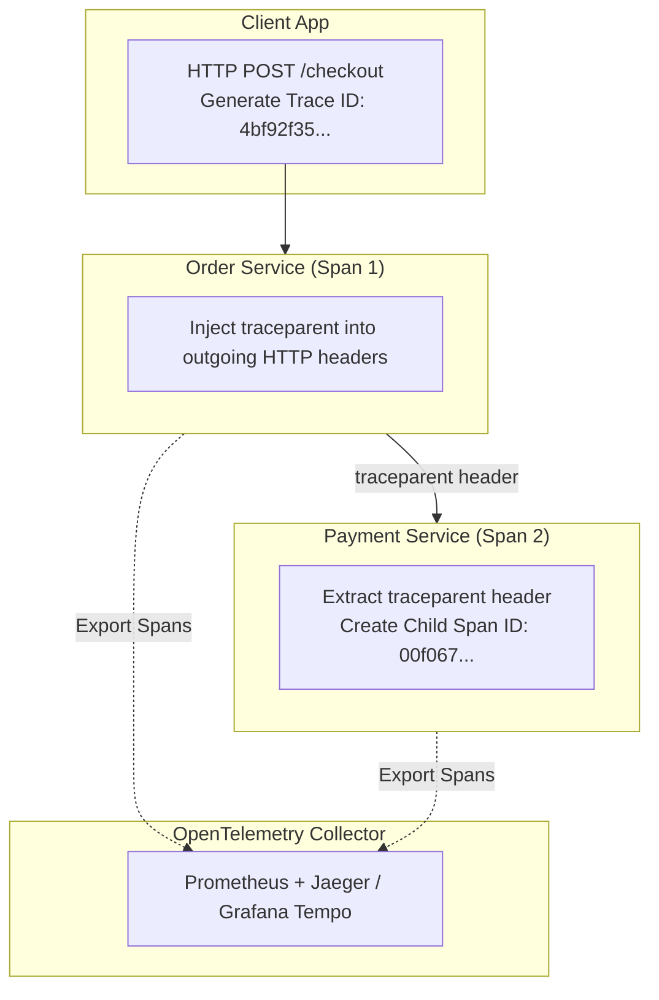

# 04. Distributed Transactions, Sagas & Observability

This chapter presents patterns for coordinating transactions across decoupled microservice databases (Sagas vs 2PC) and implementing end-to-end distributed observability (Tracing, Metrics, Logs).

---

## 🔀 Distributed Transactions: 2PC vs Saga Pattern

### 1. Two-Phase Commit (2PC)
A synchronous protocol that uses a central Coordinator to guarantee ACID properties across distributed databases.



> ⚠️ **2PC Disadvantages**: Blocking protocol. If the Coordinator fails during Phase 2, database resources remain locked indefinitely, degrading system availability.

---

### 2. Saga Pattern (Saga Execution Coordinator)
Replaces blocking distributed locks with a sequence of local transactions. If a step fails, the Saga Orchestrator executes **Compensating Transactions** in reverse order to undo changes.



---

## ☕ Production Java Implementation: Saga Orchestrator Engine

```java
package com.example.distributed.saga;

import java.util.*;
import java.util.function.Supplier;

/**
 * Lightweight Saga Orchestration Engine with automatic compensation rollback.
 */
public class SagaOrchestrator {

    public record SagaStep(
        String name,
        Supplier<Boolean> action,
        Runnable compensation
    ) {}

    private final List<SagaStep> steps = new ArrayList<>();

    public SagaOrchestrator addStep(String name, Supplier<Boolean> action, Runnable compensation) {
        steps.add(new SagaStep(name, action, compensation));
        return this;
    }

    /**
     * Executes the Saga sequence. Rollback compensations occur in reverse order if any step fails.
     */
    public boolean execute() {
        Deque<SagaStep> executedSteps = new ArrayDeque<>();

        for (SagaStep step : steps) {
            System.out.println("[SAGA] Executing Step: " + step.name());
            try {
                boolean success = step.action().get();
                if (success) {
                    executedSteps.push(step);
                } else {
                    System.err.println("[SAGA] Step FAILED: " + step.name() + ". Initiating Compensation Rollback...");
                    rollback(executedSteps);
                    return false;
                }
            } catch (Exception e) {
                System.err.println("[SAGA] Step EXCEPTION in " + step.name() + ": " + e.getMessage());
                rollback(executedSteps);
                return false;
            }
        }

        System.out.println("[SAGA] All steps completed successfully!");
        return true;
    }

    private void rollback(Deque<SagaStep> executedSteps) {
        while (!executedSteps.isEmpty()) {
            SagaStep stepToCompensate = executedSteps.pop();
            System.out.println("[SAGA] Rolling back Step: " + stepToCompensate.name());
            try {
                stepToCompensate.compensation().run();
            } catch (Exception e) {
                System.err.println("[SAGA CRITICAL] Compensation failed for step " + stepToCompensate.name() + ": " + e.getMessage());
            }
        }
    }
}
```

---

## 👁️ Distributed Observability: Distributed Tracing & W3C Trace Context

In a distributed microservice topology, a single user click triggers cascading downstream HTTP/gRPC calls. **Distributed Tracing** correlates all telemetry across services using W3C Trace Context headers.

### W3C `traceparent` Header Format

```http
traceparent: 00-4bf92f3577b34da6a3ce929d0e0e4736-00f067aa0ba902b7-01
            --|--------------------------------|----------------|--
          Version           Trace ID                Parent Span ID  Flags
```



---

## 📊 The Three Pillars of Distributed Observability

| Pillar | Data Type | Primary Tooling | Best Used For |
| :--- | :--- | :--- | :--- |
| **Metrics** | Numeric aggregations over time (Counters, Gauges, Histograms) | Prometheus, Grafana, Datadog | Real-time alerting, SLI/SLO dashboards, CPU/memory usage |
| **Logs** | Discrete event records with timestamp + JSON context | Splunk, ElasticSearch (ELK), Loki | Root cause debugging, error stack trace analysis |
| **Traces** | Call graph DAGs spanning multiple microservices | Jaeger, Zipkin, Grafana Tempo | Latency bottleneck identification, dependency mapping |
