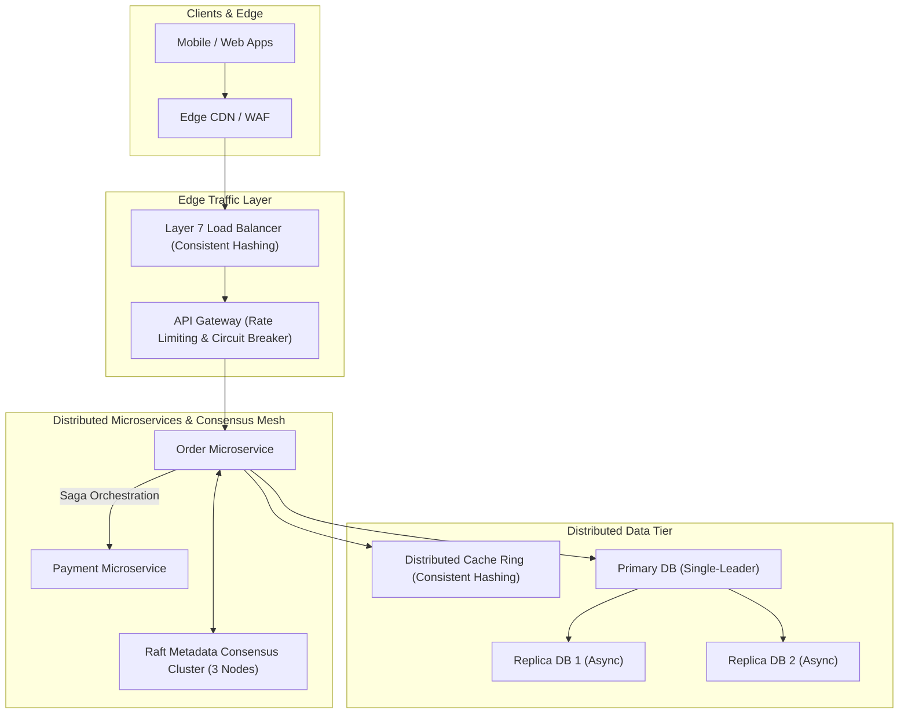

# Understanding Distributed Systems

A comprehensive, production-grade guide to designing, building, and operating resilient, scalable distributed systems. Based on concepts from Roberto Vitillo's *Understanding Distributed Systems*, top-tier distributed systems research, and enterprise architectural standards.

---

## 📐 Table of Contents

| Section | Subject | Key Concepts |
| :--- | :--- | :--- |
| **00. Cheatsheet** | [Distributed Systems Cheatsheet](00_distributed_systems_cheatsheet.md) | CAP & PACELC Theorem Matrix, Consistency Models Hierarchy, Resiliency Patterns, Time & Clocks Matrix |
| **01. Communication & Coordination** | [Network Protocols, RPC & Clocks](01_communication_and_coordination/01_network_protocols_rpc_and_clocks.md) | TCP vs UDP, HTTP/2 & gRPC / Protobuf, Physical Clocks (NTP, TrueTime) vs Logical Clocks (Lamport, Vector Clocks) |
| **02. Scalability & Availability** | [Sharding, Replication & Consensus](02_scalability_and_availability/02_sharding_replication_and_consensus.md) | Consistent Hashing (Virtual Nodes), Replication topologies (Single-Leader, Multi-Leader, Dynamo $R+W>N$), Raft & Paxos Consensus |
| **03. Resiliency & Fault Tolerance** | [Fault Models, Retries & Rate Limiting](03_resiliency_and_fault_tolerance/03_fault_models_retries_and_rate_limiting.md) | Crash-Stop vs Byzantine faults, Circuit Breakers, Exponential Backoff with Decorrelated Jitter, Bulkheads, Idempotency Keys |
| **04. Distributed Transactions & Observability** | [Sagas, 2PC & Observability](04_distributed_transactions_and_observability/04_sagas_2pc_and_observability.md) | Two-Phase Commit (2PC) vs Saga Pattern (Orchestration vs Choreography), Distributed Tracing (W3C `traceparent`), Metrics & Logs |

---

## 🌐 Distributed Systems Architecture Overview

---

## 🎯 Core Engineering Principles

1. **Expect Failure as the Baseline**: Networks drop packets, disks fail, nodes freeze due to GC pauses, and clocks drift. Design self-healing systems via retries with jitter, circuit breakers, and automated failover.
2. **Explicit Trade-offs via PACELC**: Recognize that under network partitions ($P$), you choose between Availability ($A$) and Consistency ($C$); else ($E$), under normal operation, you trade off Latency ($L$) vs Consistency ($C$).
3. **Immutability & Idempotency**: State changes should be driven by append-only event logs. Every state-changing API request must include a unique Idempotency Key to guarantee safely retried operations.
4. **Decoupled Asynchronous Workflows**: Use Saga patterns with compensating transactions rather than blocking distributed locks or two-phase commits (2PC) across service boundaries.
